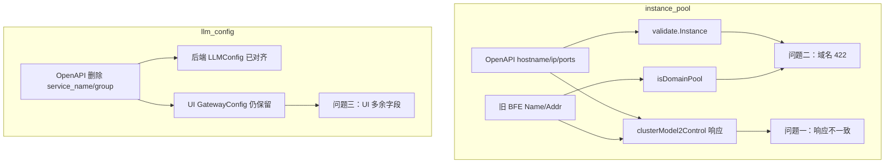

# 集群 API 问题整理

> **模块**：`/clusters`（OpenAPI v1）  
> **整理日期**：2026-07-31  
> **状态**：待修复（后端 #1/#2，UI #3）  
> **关联文档**：[clusters.md](../../api-define/OpenAPI接口定义/clusters.md)、[00-common.md](../../api-define/OpenAPI接口定义/00-common.md)

---

## 1. 概述

在对齐新版 OpenAPI 文档与 UI 实现的过程中，发现集群模块存在以下问题：

| # | 问题 | 优先级 | 责任方 | 方向 | 当前 UI 应对 |
|---|------|--------|--------|------|-------------|
| 1 | `instance_pool` 响应字段结构与文档不一致 | P1 | 后端 | GET 响应 | `normalizeInstance()` 做旧字段映射 |
| 2 | 域名模式与 `ip` 字段校验冲突 | P0 | 后端 | POST/PUT 请求 | 域名模式提交会 422 |
| 3 | `llm_config.service_name` / `group` 已删除但 UI 仍保留 | P1 | UI | 请求/展示 | 仍展示并必填，提交多余字段 |

**问题 1、2 共同特征**：请求侧 OpenAPI 已切换为 `hostname` / `ip` / `weight` / `ports`，但后端内部仍部分沿用 BFE 旧语义（`Name` / `Addr`、域名写入 `ip`），导致文档、校验、运行时逻辑三者未对齐。

**问题 3 特征**：新版 OpenAPI（v0.3.0）已从 `llm_config` 删除 `service_name`、`group`，改为通过 `provider_type` + `models` 描述服务；后端模型已同步，UI 未跟进。

---

## 1.1 涉及接口清单

Base URL：`http://{host}:{port}/open-api/v1`（示例：`http://127.0.0.1:8183/open-api/v1`）

`/clusters` 模块文档定义共 **5 个接口**（[clusters.md](../../api-define/OpenAPI接口定义/clusters.md) §2.1–§2.5），与本整理相关的如下：

| Method | 完整 Path |
|--------|-----------|
| `POST` | `/open-api/v1/clusters` |
| `GET` | `/open-api/v1/clusters` |
| `GET` | `/open-api/v1/clusters/{cluster_name}` |
| `PATCH` | `/open-api/v1/clusters/{cluster_name}` |
| `DELETE` | `/open-api/v1/clusters/{cluster_name}` |

### 按问题汇总

**问题 #1 — 响应 `Data.instance_pool[]` 返回 `Name`/`Addr` 而非 `hostname`/`ip`**

| Method | 完整 Path |
|--------|-----------|
| `GET` | `/open-api/v1/clusters/{cluster_name}` |
| `GET` | `/open-api/v1/clusters` |
| `POST` | `/open-api/v1/clusters` |
| `PATCH` | `/open-api/v1/clusters/{cluster_name}` |
| `DELETE` | `/open-api/v1/clusters/{cluster_name}` |

> 上述 5 个接口凡返回 `ClusterData`，均经同一函数 `clusterModel2Control()` 组装，故 `instance_pool` 问题一致。  
> **不受影响**：POST/PATCH 的**请求 Body** 中 `instance_pool`（入参已用 `hostname`/`ip`，校验正常）。

**问题 #2 — 域名模式 `instance_pool[].ip` 填域名导致 422**

| Method | 完整 Path |
|--------|-----------|
| `POST` | `/open-api/v1/clusters` |
| `PATCH` | `/open-api/v1/clusters/{cluster_name}` |

> **不受影响**：GET 列表/详情（只读）；DELETE；IP 模式（`hostname`/`ip` 均为数字 IP）可 200。

**问题 #3 — UI 仍使用已删除的 `llm_config.service_name` / `group`**

| Method | 完整 Path |
|--------|-----------|
| `POST` | `/open-api/v1/clusters` |
| `PATCH` | `/open-api/v1/clusters/{cluster_name}` |
| `GET` | `/open-api/v1/clusters` |
| `GET` | `/open-api/v1/clusters/{cluster_name}` |

> **后端/API 文档**：`llm_config` 已对齐，无额外接口 bug；本项为 **UI 待改**。

---

## 2. 问题一：`Data.instance_pool[]` 响应字段与 OpenAPI 文档不一致

### 2.0 问题描述

## 问题描述：
集群相关接口对于instance_pool的返回内容与文档定义不一致

## 涉及的接口：

| Method | 完整 Path |
|--------|-----------|
| `POST` | `/open-api/v1/clusters` |
| `GET` | `/open-api/v1/clusters` |
| `GET` | `/open-api/v1/clusters/{cluster_name}` |
| `PATCH` | `/open-api/v1/clusters/{cluster_name}` |
| `DELETE` | `/open-api/v1/clusters/{cluster_name}` |

文档定义 `instance_pool` 字段的返回结构为：

```json
{
  "instance_pool": [
    {
      "hostname": "backend-1",
      "ip": "10.0.0.1",
      "weight": 50,
      "ports": { "Default": 8080 }
    }
  ]
}
```

| 字段 | 类型 | 说明 |
|------|------|------|
| `hostname` | string | 实例主机名 |
| `ip` | string | 实例 IP |
| `weight` | number | 权重 |
| `ports` | object | 端口映射，如 `{"Default": 8080}` |

目前接口返回的 `instance_pool` 字段结构为：

```json
{
  "instance_pool": [
    {
      "Name": "172.19.1.187",
      "Addr": "172.19.1.187",
      "Port": 31801,
      "Ports": {
        "Default": 31801
      },
      "Weight": 1,
      "Disable": false
    }
  ]
}
```

| 字段 | 类型 | 说明 |
|------|------|------|
| `Name` | string | 文档无此字段（疑似对应 `hostname`） |
| `Addr` | string | 文档无此字段（疑似对应 `ip`） |
| `Port` | number | 文档无此字段（疑似对应 `ports.Default`） |
| `Ports` | object | 字段名大小写与文档 `ports` 不一致 |
| `Weight` | number | 字段名大小写与文档 `weight` 不一致 |
| `Disable` | boolean | 文档无此字段 |

| 维度 | 文档 | 实际 |
|------|------|------|
| 命名风格 | snake_case（`hostname`、`ip`、`weight`、`ports`） | PascalCase（`Name`、`Addr`、`Port`、`Ports`、`Weight`、`Disable`） |
| 字段数量 | 4 个 | 6 个，语义与文档不完全对应 |
| 端口表达 | 仅 `ports` 对象 | 同时存在 `Port` 与 `Ports` |

---

> 写法参考：[yf-networks/ai-gateway-api#35](https://github.com/yf-networks/ai-gateway-api/issues/35)

### 2.1 Issue 标题（可直接用于 GitHub）

**`[OpenAPI] GET/PATCH/POST /v1/clusters* 响应 Data.instance_pool[] 返回 Name/Addr 而非 hostname/ip`**

- **类型**：Bug  
- **优先级**：P1  
- **责任方**：ai-gateway-api

---

### 2.2 复现

**请求（集群详情）**

```http
GET http://127.0.0.1:8183/open-api/v1/clusters/my-cluster
Authorization: Bearer <token>
```

**实际响应（节选 `Data.instance_pool`）**

```json
{
  "ErrNum": 200,
  "ErrMsg": "success",
  "Data": {
    "name": "my-cluster",
    "instance_pool": [
      {
        "Name": "172.19.1.187",
        "Addr": "172.19.1.187",
        "Port": 31801,
        "Ports": { "Default": 31801 },
        "Weight": 1,
        "Disable": false
      }
    ]
  }
}
```

**文档期望（[clusters.md](../../api-define/OpenAPI接口定义/clusters.md) §2.3 成功返回示例，`Data.instance_pool[0]`）**

```json
{
  "hostname": "backend-1",
  "ip": "10.0.0.1",
  "weight": 50,
  "ports": { "Default": 8080 }
}
```

同一集群用 **POST/PATCH 提交** 时，Body 里写文档字段是可以通过的：

```json
{
  "instance_pool": [
    {
      "hostname": "172.19.1.187",
      "ip": "172.19.1.187",
      "weight": 1,
      "ports": { "Default": 31801 }
    }
  ]
}
```

但创建/更新成功后的**返回体**里，`instance_pool` 仍会变成上面的 `Name`/`Addr` 格式。

---

### 2.3 原因分析（一句话）

这不是业务逻辑算错，而是 **OpenAPI 响应组装时直接把 BFE 内部 `icluster_conf.Instance` 序列化出去** 导致的：该结构体的 JSON tag 是 `Name`/`Addr`/`Weight`/`Ports`（BFE 旧格式），与 OpenAPI 文档定义的 `hostname`/`ip`/`weight`/`ports` 不一致。请求侧有 `Instancesc2i()` 做字段转换，响应侧缺少反向的 `Instancei2c()`。

---

### 2.4 调用链分析

#### 受影响接口（5 个返回体 + 2 个请求体，详见 §1.1）

与 §1.1 问题 #1 表一致。凡调用 `clusterModel2Control()` 返回 `ClusterData` 的接口均受影响，含 **DELETE**（返回被删集群快照）。

| Method | 完整 Path |
|--------|-----------|
| `GET` | `/open-api/v1/clusters/{cluster_name}` |
| `GET` | `/open-api/v1/clusters` |
| `POST` | `/open-api/v1/clusters` |
| `PATCH` | `/open-api/v1/clusters/{cluster_name}` |
| `DELETE` | `/open-api/v1/clusters/{cluster_name}` |

上述接口最终都调用 **`clusterModel2Control()`** 构造 `ClusterData` 响应。

---

**1. 响应结构体声明使用了内部类型**（`endpoints/openapi_v1/product_cluster/one.go:103`）

```go
type ClusterData struct {
    // ...
    InstancePool []icluster_conf.Instance `json:"instance_pool"`
}
```

OpenAPI 层没有单独的「对外 Instance」响应类型，而是复用了 model 包里的内部结构。

---

**2. 内部 Instance 的 JSON tag 是 BFE 旧字段名**（`model/icluster_conf/pool.go:75-81`）

```go
type Instance struct {
    HostName string         `json:"Name"`
    IP       string         `json:"Addr"`
    Port     int            `json:"Port"`
    Ports    map[string]int `json:"Ports,omitempty"`
    Weight   int64          `json:"Weight"`
    Disable  bool           `json:"Disable"`
}
```

因此序列化后必然出现 `Name`、`Addr`、`Port`、`Disable`，不会出现 `hostname`、`ip`。

---

**3. 响应组装直接 append 内部实例，未做字段映射**（`one.go:153-158`）

```go
if len(cluster.SubClusters) > 0 {
    for _, sc := range cluster.SubClusters {
        if sc.InstancePool != nil {
            rsp.InstancePool = append(rsp.InstancePool, sc.InstancePool.Instances...)
        }
    }
}
```

从 DB/内存读出的 `sc.InstancePool.Instances` 是 `[]icluster_conf.Instance`，原样放进 `ClusterData.InstancePool`，框架 JSON 序列化时走内部 tag → 对外暴露 BFE 格式。

---

**4. 列表接口同样走这条路径**（`list.go:48-50`）

```go
for _, one := range list {
    rsp = append(rsp, clusterModel2Control(one))
}
```

所以 `GET /clusters` 列表里每个元素的 `instance_pool[]` 也是 `Name`/`Addr`。

---

**5. 请求侧反而已对齐文档**（`create.go:53-58` + `Instancesc2i()`）

请求入参类型：

```go
type Instance struct {
    Hostname string         `json:"hostname"`
    IP       string         `json:"ip"`
    Weight   int64          `json:"weight"`
    Ports    map[string]int `json:"ports"`
}
```

写入 DB 前会转换（`create.go:402-419`）：

```go
func Instancesc2i(is []*Instance) []icluster_conf.Instance {
    rst = append(rst, icluster_conf.Instance{
        HostName: instance.Hostname,
        IP:       instance.IP,
        Weight:   instance.Weight,
        Ports:    instance.Ports,
        Port:     port,
    })
}
```

**只有「请求 → 内部」的转换，没有「内部 → 响应」的转换。**

---

### 2.5 为什么 POST/PATCH 请求能跑通、GET 响应却不一致？

| 阶段 | 使用的类型 | JSON 字段 |
|------|-----------|-----------|
| POST/PATCH **请求 Body** | `product_cluster.Instance` | `hostname`, `ip`, `weight`, `ports` ✅ |
| 持久化 / 内存 | `icluster_conf.Instance` | 结构体字段 `HostName`, `IP`…（无 OpenAPI tag） |
| GET/POST/PATCH **响应 Data** | `icluster_conf.Instance` 直接序列化 | `Name`, `Addr`, `Weight`, `Ports`, `Port`, `Disable` ❌ |

根因是 **读写用了两套 struct**：写路径走了 OpenAPI `Instance` + `Instancesc2i()`；读路径跳过了 OpenAPI `Instance`，直接把内部 struct 当响应输出。

`Data` 里其他字段（`name`、`passive_health_check`、`llm_config` 等）在 `clusterModel2Control()` 里是手工映射到带 snake_case tag 的结构，**只有 `instance_pool` 漏做了这一步**。

---

### 2.6 字段级差异（`Data.instance_pool[i]`）

| 文档字段 | 文档类型 | 实际字段 | 实际类型 | 说明 |
|----------|----------|----------|----------|------|
| `hostname` | string | **`Name`** | string | 应对应 `HostName` |
| `ip` | string | **`Addr`** | string | 应对应 `IP` |
| `weight` | int | **`Weight`** | int | PascalCase |
| `ports` | map[string]int | **`Ports`** | map[string]int | PascalCase |
| （无） | — | **`Port`** | int | 冗余，等于 `Ports.Default` |
| （无） | — | **`Disable`** | bool | BFE 内部字段，文档未定义 |

---

### 2.7 可行的修复方向

**1. 新增响应转换函数（推荐，与 `Instancesc2i` 对称）**

在 `product_cluster` 包增加：

```go
func Instancei2c(instances []icluster_conf.Instance) []Instance
```

映射规则：

- `HostName` → `hostname`
- `IP` → `ip`
- `Weight` → `weight`
- `Ports` → `ports`
- 丢弃 `Port`、`Disable`

在 `clusterModel2Control()` 里把：

```go
rsp.InstancePool = append(rsp.InstancePool, sc.InstancePool.Instances...)
```

改为：

```go
rsp.InstancePool = Instancei2c(append(rsp.InstancePool, sc.InstancePool.Instances...))
```

同时把 `ClusterData.InstancePool` 类型从 `[]icluster_conf.Instance` 改为 `[]Instance`（OpenAPI 响应类型）。

**2. 改内部 struct 的 json tag（不推荐）**

直接改 `icluster_conf.Instance` 的 tag 会影响 BFE 配置导出、inner API 等内部消费方，波及面大。

**3. 补集成测试**

断言 `GET /open-api/v1/clusters/{name}` 的 `Data.instance_pool[0]` 含 `hostname`/`ip`，且不含 `Name`/`Addr`/`Disable`。

---

### 2.8 结论

`GET /open-api/v1/clusters/{cluster_name}`（及列表、创建/更新成功返回）中 **`Data.instance_pool[]` 返回 BFE 内部 JSON 字段名**，与 [clusters.md](../../api-define/OpenAPI接口定义/clusters.md) 定义的 OpenAPI `Instance` 结构不一致。

根本原因是：**`clusterModel2Control()` 未将 `icluster_conf.Instance` 转换为 OpenAPI 响应结构，而请求路径已有 `Instancesc2i()` 转换**。只能从 ai-gateway-api 修复；前端目前在 `InstancePool.vue` 的 `normalizeInstance()` 里做 `Name`→`hostname` 等映射作为临时兼容。

---

### 2.9 验收标准

- [ ] `GET /open-api/v1/clusters/{cluster_name}` → `Data.instance_pool[i]` 仅有 `hostname`、`ip`、`weight`、`ports`
- [ ] `GET /open-api/v1/clusters` → 每个元素的 `instance_pool[i]` 格式同上
- [ ] `POST` / `PATCH` 成功返回的 `Data.instance_pool[i]` 格式同上
- [ ] 响应中不出现 `Name`、`Addr`、`Port`、`Ports`、`Weight`、`Disable`
- [ ] `DELETE /open-api/v1/clusters/{cluster_name}` → 返回快照中 `instance_pool[i]` 格式同上
- [ ] POST/PATCH 请求 Body 仍接受 `hostname`/`ip`/`weight`/`ports`，行为不变

---

## 3. 问题二：域名模式实例与 `ip` 字段校验冲突

### 3.1 类型与优先级

- **类型**：Bug  
- **优先级**：P0  
- **影响**：POST/PATCH 请求；UI 域名模式无法成功提交

### 3.1.1 涉及接口

| Method | 完整 Path |
|--------|-----------|
| `POST` | `/open-api/v1/clusters` |
| `PATCH` | `/open-api/v1/clusters/{cluster_name}` |

完整清单见 **§1.1**。

### 3.2 问题描述

UI 支持两种实例形态：

- **IP 模式**：填写数字 IP + 端口
- **域名模式**：填写域名（如 `api.example.com`），默认端口 443

域名模式下，前端将域名同时写入 `hostname` 和 `ip` 后提交（与旧 BFE 行为一致）。但新版 API 校验要求 `ip` 必须是 **IP Address**（纯 IPv4/IPv6），不接受域名，导致提交返回 **422**。

与此同时，后端运行时仍通过 `instance.IP` 是否为可解析 IP 来判断「域名池」（`isDomainPool()`），与新版校验规则矛盾。

### 3.3 文档定义

[clusters.md](../../api-define/OpenAPI接口定义/clusters.md) Instance 结构：

| 字段 | 类型 | 合法性 |
|------|------|--------|
| `hostname` | [Hostname](../../api-define/OpenAPI接口定义/00-common.md#1-主机名hostname) | RFC 1123 域名 **或** IPv4/IPv6 |
| `ip` | [IP Address](../../api-define/OpenAPI接口定义/00-common.md#2-ip-地址ip-address) | **仅** IPv4/IPv6 数字地址 |

文档**未定义**「域名模式」专用字段，也未说明域名后端应如何填写 `ip`。

### 3.4 实际行为（本地实测）

| 提交 payload | 结果 | 说明 |
|--------------|------|------|
| `hostname=域名`, `ip=域名` | **422** | UI 域名模式当前行为 |
| `hostname=域名`, `ip=空/不传` | **422** | `ip` 必填 |
| `hostname=域名`, `ip=数字IP` | **200** | 可成功，但语义不合理（域名后端硬填 IP） |
| `hostname=IP`, `ip=IP` | **200** | IP 模式正常 |

域名模式提交示例（会 422）：

```json
{
  "instance_pool": [
    {
      "hostname": "api.example.com",
      "ip": "api.example.com",
      "weight": 1,
      "ports": { "Default": 443 }
    }
  ]
}
```

### 3.5 根因分析

**（1）新版校验强制 `ip` 为数字 IP**

```go
// ai-gateway-api/lib/validate/validate.go
func Instance(inst icluster_conf.Instance) error {
    if err := Hostname(inst.HostName); err != nil { ... }
    if err := IPAddress(inst.IP); err != nil { ... }  // net.ParseIP，域名一律非法
    ...
}
```

**（2）后端运行时仍依赖「ip 字段存域名」的旧逻辑**

```go
// ai-gateway-api/model/icluster_conf/cluster.go
func isDomainPool(subClusters []*SubCluster) bool {
    for _, instance := range subCluster.InstancePool.Instances {
        if net.ParseIP(instance.IP) == nil {
            return true  // ip 不可解析为 IP → 域名池
        }
    }
}
```

单测 `newTestClusterDomain()` 也沿用该假设：`Instances[0].IP = "example.com"`。

域名池会触发：

- `DisableHealthCheck = true`
- `DisableHostHeader = true`

**（3）前端域名模式与旧逻辑一致，但与新校验冲突**

```javascript
// InstancePool.vue — buildDomainInstance()
{
    hostname: value,
    ip: value,           // 域名写入 ip，旧 BFE 语义
    ports: { Default: 443 },
    weight: 1
}
```

**（4）IP 模式行为正常**

IP 模式下 `applyHostnameFromIp()` 将 `hostname = ip`，两者均为数字 IP，校验可通过。

### 3.6 影响范围

- **UI**：集群创建/编辑向导第 4 步「实例配置」— 域名模式无法成功提交
- **API**：`POST /open-api/v1/clusters`、`PATCH /open-api/v1/clusters/{cluster_name}` 在域名实例场景返回 422
- **已有域名集群**：若历史数据 `ip` 存的是域名，编辑回显后重新提交可能失败

### 3.7 可选修复方向

| 方案 | 思路 | 优点 | 缺点 |
|------|------|------|------|
| **A（推荐）** | 放宽校验：域名实例时 `ip` 可与 `hostname` 相同或为域名，跳过 `IPAddress` 校验 | 兼容旧行为，UI 无需改动 | 需在文档中明确域名场景规则 |
| **B** | 严格按文档：`ip` 始终为数字 IP；改 `isDomainPool()` 看 `hostname` | 类型语义清晰 | 需产品定义占位 IP 策略；UI 需 DNS 解析或额外输入（已否决） |
| **C** | 扩展 API：新增 `instance_type` 或 `ip` 可选 | 语义最清晰 | 改动面大，需同步文档与 BFE 配置 |

### 3.8 建议修复方案（倾向方案 A）

1. 在 `validate.Instance()` 中：若 `Hostname()` 通过且 `net.ParseIP(ip)==nil`，且 `ip == hostname`（或按约定允许 `ip` 为空），则视为域名实例，跳过 `IPAddress` 校验。
2. 更新 `clusters.md`：补充域名实例的 `hostname` / `ip` 填写规则。
3. 补充单测：域名实例创建成功、`isDomainPool()` 行为不变。
4. 前端保持现有域名模式逻辑，无需用户额外填 IP。

### 3.9 验收标准

- [ ] UI 域名模式（仅填域名）可成功创建/更新集群
- [ ] IP 模式行为不变（`hostname` 与 `ip` 均为数字 IP）
- [ ] 域名实例仍正确触发 `isDomainPool()` 相关配置（关闭健康检查等）
- [ ] OpenAPI 文档明确域名实例下 `hostname` / `ip` 的合法组合
- [ ] 非法组合（如 `hostname=IP`、`ip=域名` 且不一致）仍返回 422

---

## 4. 问题三：`llm_config.service_name` / `group` 已删除但 UI 仍保留

### 4.1 类型与优先级

- **类型**：UI 未对齐 / 文档变更未落地  
- **优先级**：P1  
- **影响**：大模型配置步骤（创建/编辑/复查）

### 4.1.1 涉及接口

| Method | 完整 Path |
|--------|-----------|
| `POST` | `/open-api/v1/clusters` |
| `PATCH` | `/open-api/v1/clusters/{cluster_name}` |
| `GET` | `/open-api/v1/clusters` |
| `GET` | `/open-api/v1/clusters/{cluster_name}` |

完整清单见 **§1.1**。

### 4.2 问题描述

新版 OpenAPI 在 v0.3.0 优化中已从 `llm_config` **删除** `service_name` 和 `group` 字段，改为通过 `provider_type` + `models` 直接描述 AI 服务，与服务发现解耦。

后端 `LLMConfig` 模型已无这两个字段，API 响应也不会返回它们。但 UI 大模型配置页仍保留「服务名称」「分组」输入框，且 **服务名称为必填**，复查页也会展示（通常为空）。

### 4.3 文档定义（新版，期望）

[clusters.md](../../api-define/OpenAPI接口定义/clusters.md) 表：LLM配置 当前字段：

| 参数名 | 必填 | 说明 |
|--------|------|------|
| `model_endpoint` | N | 模型列表端点，默认 `schema=https`、`uri=/v1/models` |
| `models` | Y | 支持的模型名称列表 |
| `model_mappings` | N | 模型名称映射（`source_model` / `target_model`） |
| `key` | N | 服务认证密钥，0-512 字符 |
| `provider_type` | N | AI 模型提供商类型 |

**已删除字段**（不再出现在文档中）：

| 字段 | 变更 | 说明 |
|------|------|------|
| `service_name` | **删除** | 与服务发现解耦 |
| `group` | **删除** | 与服务发现解耦 |
| `enable` | **删除** | 设置 `llm_config` 即默认开启 |

变更来源：`ai-gateway-api/design-docs/modifications/2026-07-27-openapi-optimize/api-changes.md` §3.2.6。

### 4.4 后端现状（已对齐文档）

```go
// ai-gateway-api/model/icluster_conf/cluster.go
type LLMConfig struct {
    ModelEndpoint *Endpoint  `json:"model_endpoint"`
    Models        []string   `json:"models"`
    ModelMappings []*Mapping `json:"model_mappings"`
    Key           *string    `json:"key"`
    ProviderType  *string    `json:"provider_type"`
}
```

集成测试也明确：返回中不应出现 `llm_config.service_name`、`llm_config.group`（`ai-gateway-api/test/integration/tests/clusters/design.md`）。

### 4.5 UI 现状（未对齐）

| 文件 | 现状 |
|------|------|
| `GatewayConfig.vue` | 保留 `service_name`（必填）、`group`（默认 `default`）表单项及校验 |
| `Review.vue` | 复查页展示 `service_name`、`group`（回显通常为空） |
| `index.vue` | 提交时整包 `llmConfigData` 传给 API，可能携带多余字段 |

```javascript
// GatewayConfig.vue — handleSubmit 整包提交 formData
tmpData = cloneDeep(this.formData);  // 含 service_name、group
this.$emit('submitData', { topic: 'llmConfigData', data: tmpData, ... });

// index.vue — handelData
llm_config: this.llmConfigData  // 未过滤已删除字段
```

### 4.6 实际影响

| 场景 | 影响 |
|------|------|
| 创建/编辑集群 | 用户须填写已无 API 含义的「服务名称」，增加无效操作 |
| 提交 API | `service_name`/`group` 作为多余字段发送，后端通常忽略，不影响功能但不符合契约 |
| 编辑回显 | GET 响应无 `service_name`/`group`，复查页和表单对应项为空 |
| 旧集群迁移 | 历史数据中若有这两个字段，新版 API 也不再返回 |

### 4.7 建议修复方案（UI 侧）

1. **删除表单项**：`GatewayConfig.vue` 移除 `service_name`、`group` 的 `FormItem`、表单字段、校验规则（`validServiceName`）。
2. **删除复查展示**：`Review.vue` 移除「服务名称」「分组」两行。
3. **提交过滤**：在 `GatewayConfig.vue` 或 `index.vue` 的 `handelData()` 中，提交 `llm_config` 前剔除 `service_name`、`group`（及任何其他已删除字段如 `enable`）。
4. **i18n**：保留或标记废弃相关文案（`gatewayConfig.serviceName`、`llmConfig.group` 等），避免残留引用。
5. **设计文档**：同步更新 `design-docs/sys-design/各模块实现细节设计/AI业务集群.md`（仍写 `service_name` 必填）。

### 4.8 验收标准

- [ ] 大模型配置步骤不再展示「服务名称」「分组」输入框
- [ ] 复查页不再展示 `service_name` / `group`
- [ ] 提交 `llm_config` payload 仅含文档定义字段
- [ ] `provider_type`、`models` 等现有必填校验不受影响
- [ ] 创建/编辑/回显流程正常

---

## 5. 前端现状与临时兼容

在后端修复前，前端已做如下处理：

| 场景 | 文件 | 处理方式 |
|------|------|----------|
| 响应回显 | `InstancePool.vue` — `normalizeInstance()` | 映射 `Name`→`hostname`、`Addr`→`ip`、`Weight`→`weight`、`Ports`→`ports` |
| 请求提交 | `InstancePool.vue` — `formatInstanceForApi()` | 仅提交 `hostname`、`ip`、`weight`、`ports`（已去掉 `Name`/`Addr`/`tags` 等冗余字段） |
| IP 模式 | `applyHostnameFromIp()` | 自动 `hostname = ip` |
| 域名模式 | `buildDomainInstance()` | `hostname = ip = 域名`（当前会 422，待后端修复） |
| weight UI | `InstancePool.vue` | 界面不展示 weight 列，提交时默认 `weight: 1` |
| llm_config 多余字段 | `GatewayConfig.vue` / `Review.vue` | 仍保留 `service_name`/`group`（待移除，见问题三） |

---

## 6. 问题关联与修复顺序建议



建议修复顺序：

1. **P0**：问题二（域名模式 422）— 阻塞 UI 域名形态
2. **P1**：问题三（`service_name`/`group`）— UI 改动，可独立进行
3. **P1**：问题一（`instance_pool` 响应字段）— 消除前后端双套字段名
4. **后续**：后端部署完成后，清理前端 `normalizeInstance()` 旧字段兼容

---

## 7. 参考代码与文档索引

### 7.1 OpenAPI 文档

- [clusters.md](../../api-define/OpenAPI接口定义/clusters.md)
- [00-common.md](../../api-define/OpenAPI接口定义/00-common.md) — Hostname、IP Address 类型

### 7.2 后端

| 路径 | 说明 |
|------|------|
| `ai-gateway-api/endpoints/openapi_v1/product_cluster/one.go` | 响应组装 `clusterModel2Control()` |
| `ai-gateway-api/endpoints/openapi_v1/product_cluster/create.go` | 请求模型、`Instancesc2i()` |
| `ai-gateway-api/model/icluster_conf/pool.go` | 内部 `Instance`（`Name`/`Addr`） |
| `ai-gateway-api/model/icluster_conf/cluster.go` | `isDomainPool()` |
| `ai-gateway-api/lib/validate/validate.go` | `Instance()`、`IPAddress()`、`Hostname()` |
| `ai-gateway-api/model/icluster_conf/cluster_test.go` | `newTestClusterDomain()` |
| `ai-gateway-api/design-docs/modifications/2026-07-27-openapi-optimize/api-changes.md` | §3.2.6 `llm_config` 删除 `service_name`/`group` |
| `ai-gateway-api/test/integration/tests/clusters/design.md` | 响应不应含 `llm_config.service_name` |

### 7.3 前端

| 路径 | 说明 |
|------|------|
| `ai-gateway-web/src/modules/Clusters/components/InstancePool.vue` | 实例配置 UI、字段映射、提交格式化 |
| `ai-gateway-web/src/modules/Clusters/components/index.vue` | 集群提交 `formatInstancePoolForApi()` |
| `ai-gateway-web/src/modules/Clusters/components/GatewayConfig.vue` | 大模型配置（含多余 `service_name`/`group`） |
| `ai-gateway-web/src/modules/Clusters/components/Review.vue` | 复查页展示 `service_name`/`group` |
| `ai-gateway-web/design-docs/sys-design/各模块实现细节设计/AI业务集群.md` | 旧设计仍写 `service_name` 必填 |

### 7.4 关联变更文档

- [ui-code-changes.md](./ui-code-changes.md)
- [ui-common-type-alignment.md](./ui-common-type-alignment.md)
- [openapi-doc-diff.md](./openapi-doc-diff.md)

---

## 8. Issue 标签建议

| 问题 | 建议标签 |
|------|----------|
| #1 #2 | `bug` · `api` · `clusters` · `instance_pool` · `validation` |
| #3 | `ui` · `clusters` · `llm_config` · `openapi-migration` |
