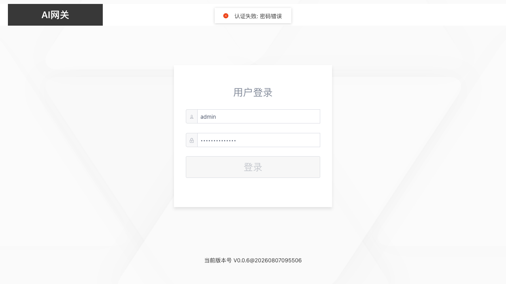
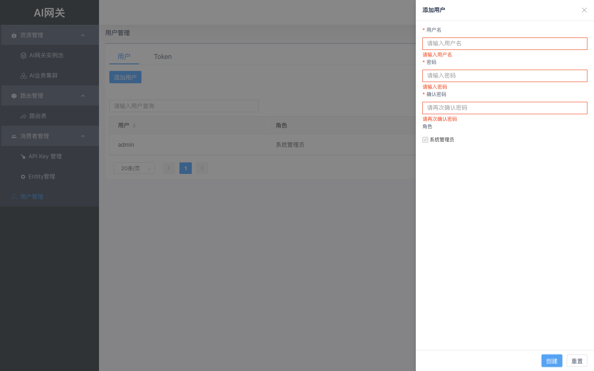

# 01 登录与用户管理

本章覆盖控制台登录、用户管理、Token 管理与退出登录。用户管理仅管理员可见。

## 1.1 登录

浏览器打开 `http://<控制台IP>:8088`，输入用户名与密码，点击「登录」。

账号或密码错误时，页面顶部弹出错误提示，不会进入控制台：

## 1.2 用户列表

用户管理 → 用户管理，列表展示用户名、角色、创建时间等；支持按用户名搜索。

## 1.3 添加用户

点击「添加用户」，填写用户名、密码、确认密码与角色。密码需满足复杂度要求（长度 ≥ 8，含大小写与数字）。

必填项留空或格式不满足时提交，字段下方出现红色校验提示：

## 1.4 Token 管理

切换到 Token 页签，可为用户创建 API Token（用于 OpenAPI 调用），列表展示 Token 值（脱敏）、过期时间等。

点击「创建Token」，选择用户与过期时间后提交，**Token 值可点击详情查看**。

## 1.5 修改密码与退出

- 修改密码：用户列表行操作「修改密码」，需输入原密码与新密码；
- 退出登录：右上角头像 → 「退出登录」，会话立即失效。
