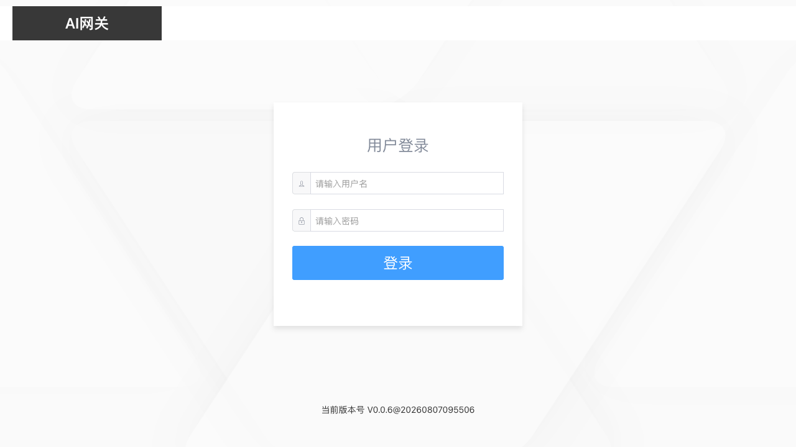
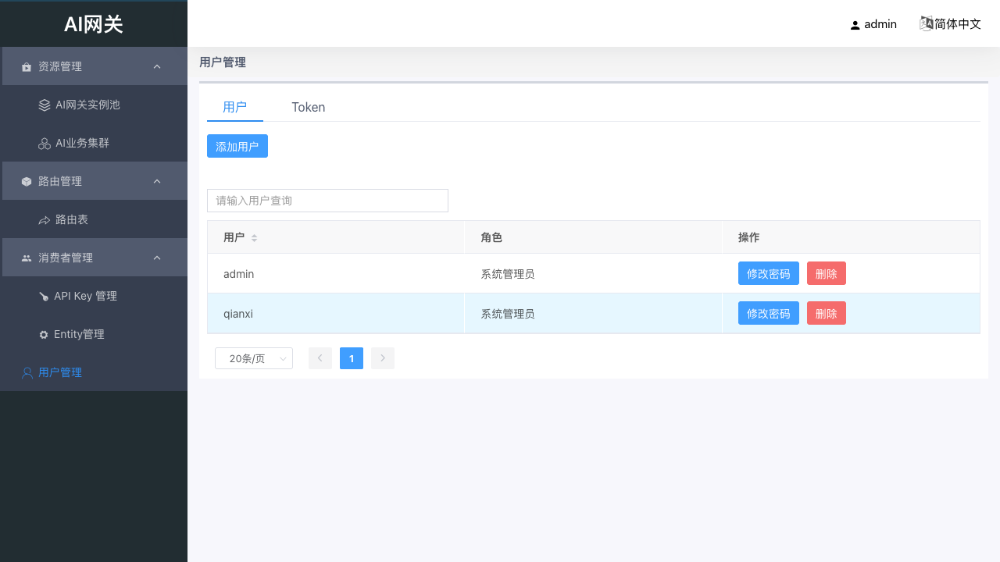
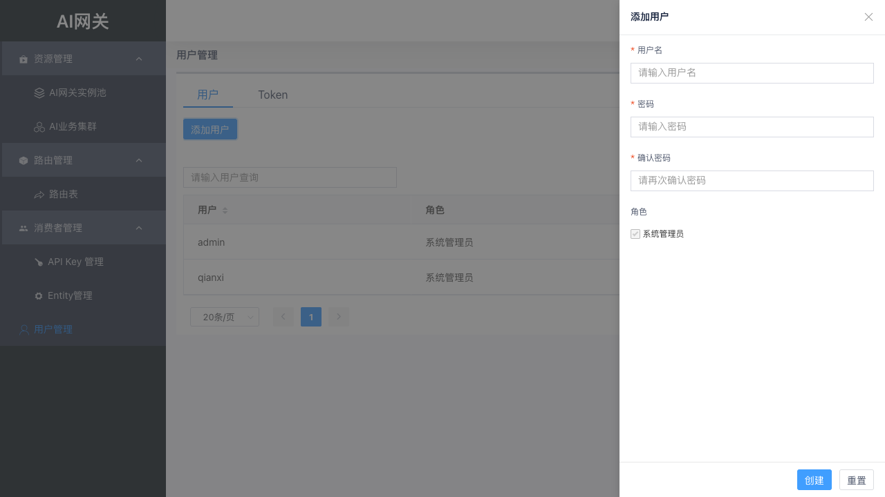
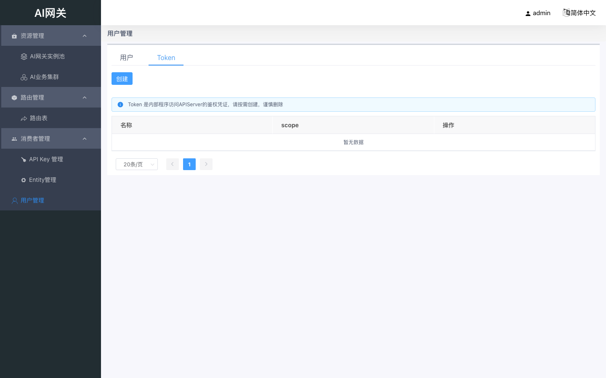
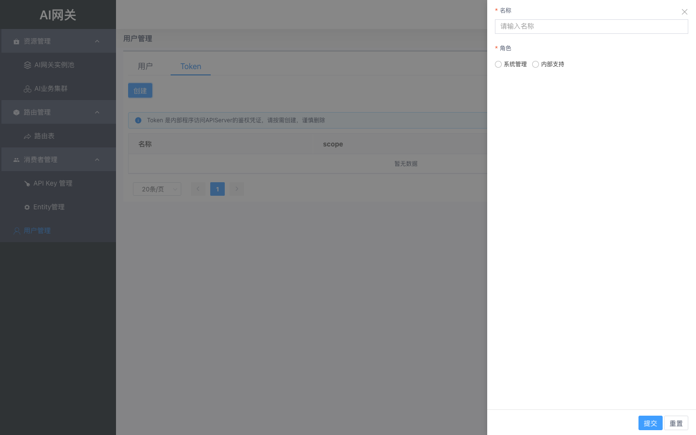

# 01 登录与用户管理

本章覆盖控制台登录、用户管理、Token 管理与退出登录。控制台仅面向管理员，所有功能需登录后访问。

## 1.1 登录

### 登录入口

浏览器打开控制台登录页，进入登录页面。页面顶部显示「AI 网关」标题，中部为登录表单，底部显示当前版本号。

- **单机本地部署**：`http://127.0.0.1:8183/login`
- **远程服务器部署**：`http://<服务器IP或域名>:8183/login`（与你在浏览器中访问控制台时地址栏一致）

### 登录操作

系统默认提供管理员账号，首次登录可直接使用：

| 字段 | 默认值 |
| --- | --- |
| 用户名 | `admin` |
| 密码 | `admin` |

登录步骤：

1. 在用户名输入框输入 `admin`（带用户图标前缀）。
2. 在密码输入框输入 `admin`（带锁图标前缀）。
3. 点击「登录」按钮提交。

> 建议首次登录后，通过 [1.2.3 修改密码](#123-修改密码) 及时修改默认密码。

**校验规则**：

- 用户名和密码均为必填，留空时输入框下方提示「请输入用户名」/「请输入密码」。
- 点击「登录」后按钮进入 2 秒防抖（防止重复提交），期间不可再次点击。

### 登录成功

登录成功后自动跳转到控制台首页，页面显示欢迎语「系统管理员 {用户名}，欢迎！」。顶部导航栏右侧显示当前登录用户名，左侧显示功能菜单。

## 1.2 用户管理

用户管理页面包含两个页签：**用户**（控制台管理员账号）和 **Token**（内部程序访问凭证）。通过页面顶部的 Tab 切换。

默认进入「用户」页签。

### 1.2.1 用户列表

用户页签展示所有控制台管理员的账号列表。

**表格列说明**：

| 列名 | 说明 |
| --- | --- |
| 用户 | 用户名，支持按用户名搜索和排序 |
| 角色 | 只有系统管理员 |
| 操作 | 修改密码、删除 |

列表上方有「创建用户」按钮（右上角）。

### 1.2.2 添加用户

点击列表上方的「创建用户」按钮，右侧弹出创建抽屉。

**表单字段**：

| 字段 | 说明 | 校验规则 |
| --- | --- | --- |
| 用户名 | 必填，最多 64 字符 | 1-64 字符；仅允许字母、数字、点(`.`)、下划线(`_`)、中划线(`-`)；不能以点、下划线、中划线开头或结尾；保留名 `admin`、`root`、`system` 不可用 |
| 密码 | 必填 | 8-128 字符；不能包含空格；不能与用户名相同或为用户名的逆序 |
| 确认密码 | 必填 | 必须与密码一致 |
| 角色 | 固定为「系统管理员」 | 复选框，默认勾选且不可取消 |

抽屉底部有「创建」和「重置」按钮。点击「创建」提交表单，校验通过后关闭抽屉并刷新列表；点击「重置」清空所有输入。

### 1.2.3 修改密码

在用户列表的操作列点击「修改密码」按钮，右侧弹出修改密码抽屉。

**表单字段**：

| 字段 | 说明 | 校验规则 |
| --- | --- | --- |
| 用户名 | 显示目标用户名，不可编辑 | 灰色禁用状态 |
| 原密码 | 仅修改**自己的**密码时显示 | 修改自己密码时必填 |
| 新密码 | 必填 | 8-128 字符；不能包含空格；不能与用户名相同或为用户名的逆序 |
| 确认密码 | 必填 | 必须与新密码一致 |

**修改自己密码 vs 修改他人密码**：

- **修改自己的密码**：表单包含「原密码」字段，需输入原密码验证身份。提交成功后弹出提示「当前用户密码已修改请重新登录」，点击确定后自动跳转到登录页，需重新登录。
- **修改他人密码**：表单不显示「原密码」字段（无需原密码即可重置）。提交成功后仅关闭抽屉并提示成功，不强制重新登录。

### 1.2.4 删除用户

在用户列表的操作列点击「删除」按钮，弹出确认框「是否确认删除用户 {用户名}?」。

- **删除其他用户**：确认后立即删除，列表自动刷新。
- **删除当前登录用户**：确认后弹出提示「当前用户已被删除请重新登录」，点击确定后自动跳转到登录页。

## 1.3 Token 管理

切换到页面顶部的 **Token** 页签，进入 Token 管理页面。

Token 是内部程序访问 API Server（管理面 API 服务，非数据面转发入口）的鉴权凭证。页面顶部有提示条：「Token 是内部程序访问 APIServer 的鉴权凭证，请按需创建，谨慎删除」。

### 1.3.1 Token 列表

**表格列说明**：

| 列名 | 说明 |
| --- | --- |
| 名称 | Token 名称 |
| scope | 权限范围，显示「系统管理」或「内部支持」 |
| 操作 | 详情、删除 |

列表上方有「创建」按钮（右上角）。

### 1.3.2 创建 Token

点击列表上方的「创建」按钮，右侧弹出创建抽屉。

**表单字段**：

| 字段 | 说明 | 校验规则 |
| --- | --- | --- |
| 名称 | 必填，最多 64 字符 | 1-64 字符；仅允许字母、数字、点(`.`)、下划线(`_`)、中划线(`-`)；不能以点、下划线、中划线开头或结尾；保留名 `admin`、`system`、`default` 不可用 |
| 角色 | 必填，单选 | 系统管理（System）/ 内部支持（Support） |

**scope 说明**：

- **系统管理**（System）：拥有所有资源的完整管理权限（查看、创建、编辑、删除、导出）。
- **内部支持**（Support）：仅可导出部分资源的数据（实例池、路由、API Key 等），不可创建、编辑或删除任何资源。适用于内部运维排查、数据备份等只读场景。

抽屉底部有「提交」和「重置」按钮。点击「提交」校验通过后创建 Token，关闭抽屉并刷新列表；点击「重置」清空所有输入。

### 1.3.3 查看 Token 详情

在 Token 列表的操作列点击「详情」按钮，右侧弹出详情抽屉。

详情抽屉展示以下信息：

| 字段 | 说明 |
| --- | --- |
| 名称 | Token 名称 |
| Scope | 权限范围（系统管理 / 内部支持） |
| Token | Token 明文值 |

### 1.3.4 删除 Token

在 Token 列表的操作列点击「删除」按钮，弹出确认框「是否确认删除 {Token名称}?」。确认后立即删除，列表自动刷新。

> 注意：删除 Token 会导致使用该 Token 的程序无法访问 API Server，请确认无程序依赖后再删除。

## 1.4 退出登录

点击页面右上角的用户名，在下拉菜单中选择「退出登录」，弹出确认框「确认注销?」。

确认后系统注销当前会话并跳转到登录页。取消则不做任何操作。
