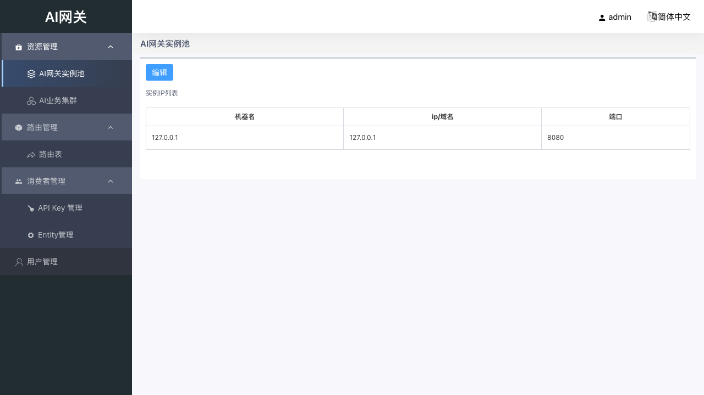
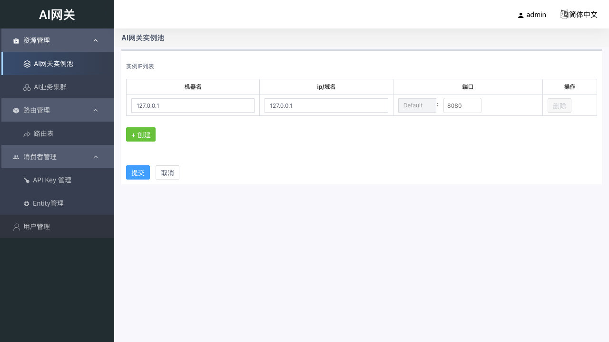
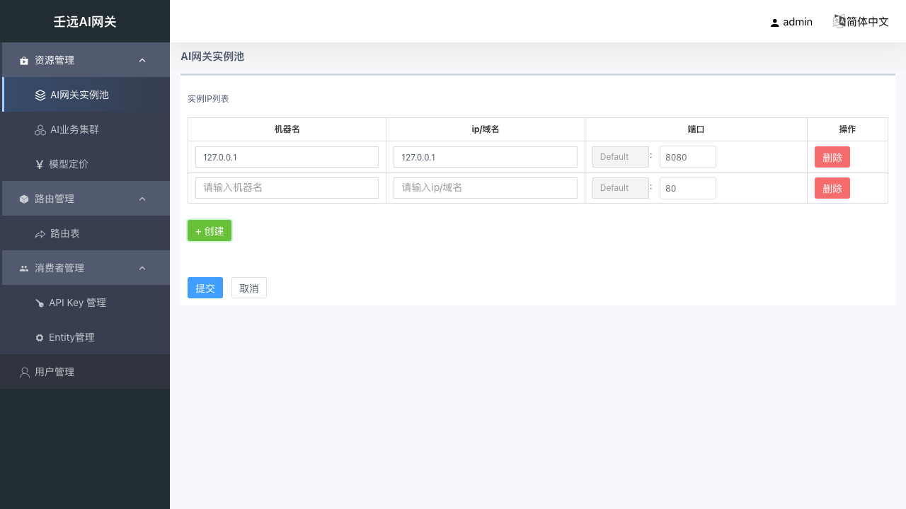

# 03 资源管理：AI 网关实例池

实例池登记数据面转发引擎（BFE）的实例地址。数据面负责接收客户端请求、执行鉴权 / 限流 / 配额 / 路由并转发到业务集群。

## 3.1 实例列表

进入 资源管理 → AI 网关实例池，展示当前已登记的实例列表。

**表格列说明**：

| 列名 | 说明 |
| --- | --- |
| 机器名 | 实例的标识名称，如 `bfe-1` |
| ip/域名 | 数据面引擎所在机器的 IP 地址或域名 |
| 端口 | Default 端口，引擎管理 / 转发端口 |

系统初始化时已预置一条默认实例（`127.0.0.1`，端口 `8080`）。**请按以下方法确认你的真实引擎地址**：

- **单机部署**（控制台和 BFE 在同一台机器）：通常保持 `127.0.0.1:8080` 即可，或改为该机器的内网 IP（如 `192.168.x.x:8080`）。
- **分布式部署**（BFE 在独立机器）：填写 BFE 所在机器的 **IP 地址 + BFE 监听端口**（默认 8080，以实际部署配置为准）。
- **验证方法**：在能访问 BFE 的机器上执行 `curl http://<IP>:<端口>/`，能返回 BFE 的默认响应即表示地址正确。

页面顶部有「编辑」按钮，点击进入编辑模式。

> **常见误区**：实例池填的是 BFE 自己的地址，不是后端模型服务的地址。后端模型服务地址在「模型服务商」的实例池中填写，见 [04 章](04-model-provider.md)。

## 3.2 编辑实例

点击页面顶部的「编辑」按钮，进入编辑模式。此时表格中每一行的字段变为可编辑输入框，同时出现「操作」列（含删除按钮），表格下方出现「+ 新增」按钮，页面底部出现「提交」和「取消」按钮。

### 新增实例

点击表格下方的「+ 新增」按钮，在列表末尾添加一行空白实例，默认端口为 `80`。

填写以下字段：

| 字段 | 必填 | 校验规则 | 说明 |
| --- | --- | --- | --- |
| 机器名 | 是 | 非空字符串 | 便于识别的名称，如 `bfe-1` |
| ip/域名 | 是 | 必须为合法 IPv4、IPv6 或 FQDN（域名）格式 | 数据面引擎所在机器地址 |
| 端口 | 是 | 1-65535 的整数 | Default 端口，与部署配置一致。默认 `80` |

> 注意：新增行默认端口为 `80`，与系统预置实例的 `8080` 不同。请填写 BFE 实际监听端口（通常 8080，以部署配置为准）。

### 删除实例

在操作列点击「删除」按钮删除对应行。

> 注意：当列表仅剩 1 行时，删除按钮会被禁用（灰色不可点击），保证至少保留 1 条实例。

### 提交保存

填写完成后点击底部「提交」按钮，系统执行以下校验：

1. **至少 1 条实例**：列表不能为空。
2. **逐条字段校验**：
   - 机器名不能为空。
   - ip/域名不能为空，且必须为合法 IPv4、IPv6 或域名格式。
   - 端口必须在 1-65535 范围内，否则弹出错误提示「Default端口错误, 范围1～65535」。
3. **IP+端口 去重**：所有实例的 `ip:端口` 组合不可重复。

校验通过后提交保存，成功后退出编辑模式并刷新列表，提示「编辑成功」。

### 取消编辑

点击底部「取消」按钮，放弃当前修改并退出编辑模式，页面重新拉取原始数据恢复。
