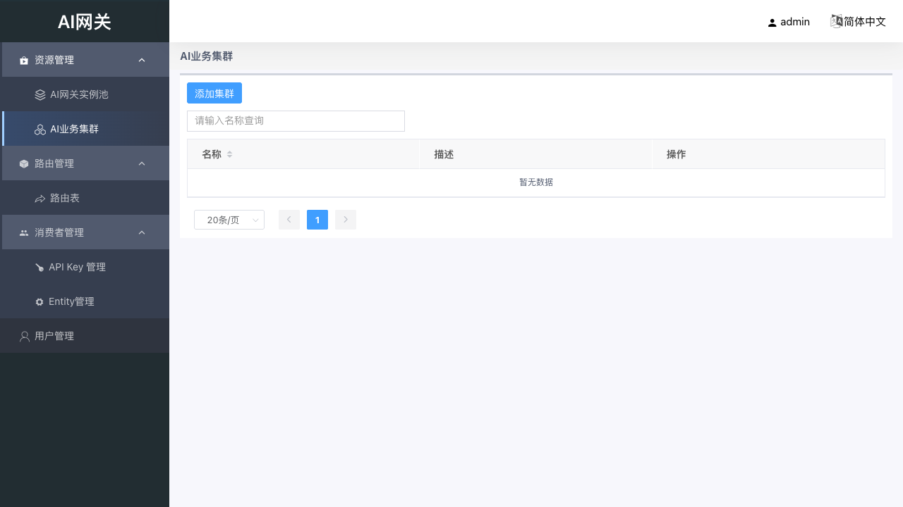
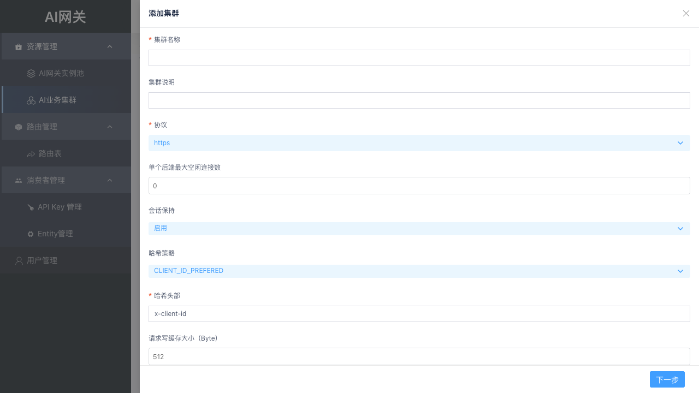
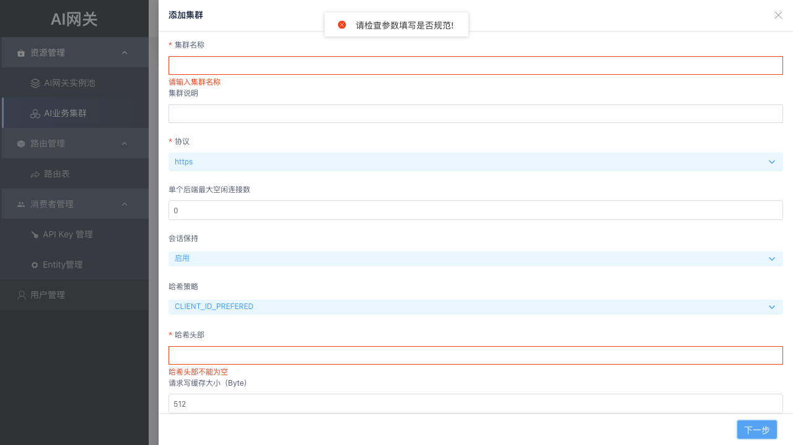

# 04 资源管理：AI 业务集群

业务集群是**后端模型服务**在网关内的抽象，也是流量转发的承载者：一个集群 = 一组后端实例（IP 或服务商域名）+ 协议 / 会话保持 / 超时重试 / 被动健康检查 / 模型配置。路由规则的目标即为「集群 + 模型」，请求被转发到集群内的后端实例。

## 4.1 集群列表

资源管理 → AI 业务集群，列表展示集群名称、状态等；行操作支持编辑、删除、查看详情。

点击「添加集群」打开创建向导，共 6 步：基础配置 → 超时和重传 → 被动健康检查 → 实例配置 → 大模型配置 → 复查&检查。

## 4.2 步骤 1：基础配置

| 字段 | 必填 | 说明 |
| ------ | ------ | ------ |
| 集群名称 | 是 | 唯一标识，创建后不可修改，命名建议体现业务含义 |
| 集群说明 | 否 | 描述用途 |
| 协议 | 是 | http / https，按后端实际选择 |
| 单个后端最大空闲连接数 | 否 | 默认 0 |
| 会话保持 | 否 | 启用 / 停用，默认停用；启用后显示「哈希策略」 |
| 哈希策略 | 否 | 见 4.3；默认 CLIENT_ID_ONLY |
| 哈希头部 | 条件必填 | 哈希策略为 CLIENT_ID_ONLY / CLIENT_ID_PREFERED 时必填 |
| 请求写缓存大小（Byte） | 否 | 默认 512 |
| 后端连接跟随客户端连接关闭 | 否 | 启用 / 停用，默认停用 |

## 4.3 会话保持与哈希策略（重点）

先将会话保持设为「启用」，才会出现「哈希策略」下拉框：

| 策略 | 含义 | 哈希头部 |
| ------ | ---------- | ---------- |
| CLIENT_IP_ONLY | 仅根据客户端 IP 做会话保持；客户端无稳定标识、只能依赖来源 IP 时使用 | 不需要 |
| CLIENT_ID_ONLY | 仅根据请求中的哈希头部做会话保持（默认）；请求稳定携带用户标识 Header / Cookie 时使用 | 必填 |
| CLIENT_ID_PREFERED | 优先使用哈希头部；请求无该头部时回退到客户端 IP | 必填 |

选择 CLIENT_ID_ONLY / CLIENT_ID_PREFERED 后，会出现「哈希头部」输入框，需填写请求中用于会话保持的 Header 名称（如 `x-client-id`）；若使用 Cookie 作为哈希 key，格式为 `Cookie:${key}`（如 `Cookie:USERID`）：

若未填写直接点「下一步」，会触发必填校验：「哈希头部不能为空」，同时集群名称等必填项也会一并校验：

> 建议：业务请求能稳定携带用户标识 Header 时选 CLIENT_ID_PREFERED 并填写头部名；只能依赖来源 IP 时选 CLIENT_IP_ONLY。

## 4.4 超时和重传

保持推荐默认值即可：

| 字段 | 默认值(ms) | 说明 |
| ------ | -------- | ------ |
| 客户端连接空闲超时 | 60000 | 上一个请求结束到读完下一个请求头部的超时，长连接空闲回收 |
| 读客户端请求Body超时 | 5000 | 读完请求头部到读完请求主体的超时，客户端发送过慢时断开 |
| 连接后端超时 | 2000 | 发起到后端建连至建连完成的超时 |
| 读后端响应头部超时 | 50000 | 开始向后端发请求到收完响应头部的超时，首包超时，流式场景关键 |
| 写响应超时 | 5000 | 开始向客户端写响应到写完全的超时，客户端接收过慢时断开 |
| 集群内重试次数 | 2 | 转发失败后同集群内重试次数 |

> 大模型推理首包耗时较长，「读后端响应头部超时」建议按服务商 SLA 放宽，避免正常请求被误超时。

## 4.5 被动健康检查

连续转发失败超过「故障阈值」时，实例被置为不健康并启动健康检查，间隔「健康检查间隔」探测恢复。

| 字段 | 说明 |
| ------ | ------ |
| 故障阈值 | 连续转发失败超过该阈值时，实例被置为不健康并启动健康检查 |
| 健康检查间隔(ms) | 启动健康检查后，检查请求的时间间隔 |
| 健康检查Host | 检查请求的 Host 字段 |
| 健康检查Uri | 检查请求的绝对路径 |
| 健康检查期望的状态码 | 判定健康的状态码；填 0 表示忽略状态码，只要有响应即视为健康 |

## 4.6 实例配置

实例形态支持两种，二选一：

- **IP（默认）**：自建机房 / 私有化部署的后端实例（vLLM / Xinference / Ollama 等）。可「+ 创建」多行实例，每行填写 IP 地址（必填）、端口（默认 80）、权重（默认 100），按权重分配流量。

- **服务商域名**：直接对接公有云模型服务商。只填一个服务商域名（如 `api.deepseek.com`），端口默认使用 443；域名模式下不支持填写多个地址，也不能与 IP 混用。

| 形态 | 适用场景 | 端口默认值 | 数量 |
| ------ | ---------- | ---------- | ------ |
| IP | 自建机房 / 私有化部署的后端实例 | 80 | 可多行，按权重分配 |
| 服务商域名 | 直接对接公有云模型服务商 | 443 | 仅一个域名 |

## 4.7 大模型配置

配置模型服务商、模型列表接口（协议 / 地址 / 路径），点击「获取」拉取模型列表并选择本集群开放的模型；如需名称转换可配置「模型重定向」；服务商需要鉴权时填写「服务商授权 Key」。

| 字段 | 必填 | 说明 |
| ------ | ------ | ------ |
| 模型服务商 | 是 | 下拉选择 |
| 模型列表接口 | 是 | 协议 + 地址 + 路径（默认 /v1/models） |
| 模型 | 是 | 点击「获取」后下拉选择 / 勾选 |
| 模型重定向 | 否 | 原模型名称 → 转发后端模型名称 |
| 服务商授权 Key | 否 | 访问模型服务的凭证 |

**常见坑**：点「获取」报「参数非法 exec-api … connection refused」＝模型列表接口不可达，检查地址 / 端口 / 网络；该错误通知不自动消失，点 × 关闭。

## 4.8 复查&检查

汇总展示前 5 步全部配置，确认无误后点击「提交」完成创建：

## 4.9 注意事项

- 集群名称创建后不可修改，命名建议体现业务含义。
- 修改集群配置会影响所有引用该集群的路由规则，请在低峰期操作。
- 模型列表接口不可达时「获取」会失败，可检查地址与网络后重试。
