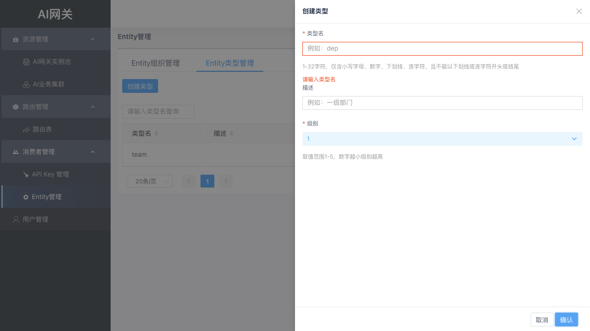

# 05 消费者管理：Entity 管理

Entity 是调用方的分组抽象（公司 / 部门 / 团队 / 个人），用于挂载**配额、限流、模型访问控制**。API-Key 可挂载到某个 Entity 组织，继承其治理策略。

消费者管理 → Entity 管理，含两个页签：Entity组织管理、Entity类型管理。

整体为三级结构：

```
Entity 类型（如：部门）
   └── Entity 组织（如：某部门-某团队）   ← 可配配额 / 限流
          └── API-Key（调用凭证）        ← 可配配额 / 限流 / 挂载
```

- **类型**：对组织的分类维度。
- **组织**：一组调用方的集合，是配额与限流的常用挂载点。
- **API-Key**：最终下发给调用方的凭证，请求时携带。

## 5.1 Entity 类型

类型定义组织的层级（级别数字越小层级越高）。路径：消费者管理 → Entity 管理（类型页签）。

类型列表支持搜索与编辑：


点击「创建类型」打开抽屉：


| 字段 | 必填 | 说明 |
| ------ | ------ | ------ |
| 类型名 | 是 | 全局唯一，1-32 字符，仅含小写字母 / 数字 / 下划线 / 连字符（如 `dep`、`team`）；创建后不可修改 |
| 级别 | 是 | 取值 1-5，数字越小级别越高；高级别类型可作为低级别组织的父级 |
| 描述 | 否 | 类型说明，≤ 255 字符，不可含控制字符 |

必填项留空提交时字段下方出现红色提示，提交被拦截：



> 重复类型名会提示「重复」类错误，请先在列表搜索确认。

## 5.2 创建组织

组织页签 → 「创建Entity」打开抽屉，除名称 / 所属类型 / 描述外，重点配置「配额信息」与「限流配置」。

- **名称**：全局唯一，创建后不可修改。
- **所属类型**：创建后不可修改。
- **父Entity**：可选；父组织的类型级别必须**小于**当前类型的级别（数字更小），否则提交被拦截。
- **允许模型 / 禁止模型**：同时命中时以禁止为准。


组织列表展示 ID、名称、类型、父级Entity、配额、限流状态：


## 5.3 配额

组织（或 Key）的配额信息控制总成本。「无限配额」选「否」后展开以下字段：

| 字段 | 说明 |
| ------ | ------ |
| 无限配额 | 选「否」后展示以下字段 |
| 配额总量 | 有限时必填，非负整数，周期内可用 Token 总量 |
| 配额单位 | 如 total_token |
| 重置周期 | 永不重置 / 每周 / 每月 |
| 配额不足时放行 | 选「是」则超额不拒绝（仅统计），余额扣到 0 仍放行本次请求 |


组织详情 / Key 详情可查看配额总量、已用、剩余与进度条，支持手动「重置配额」。

## 5.4 限流

「启用限流」选「是」后，展开 TPM 规则 / RPM 规则区域，每个区域可「添加规则」多条：


| 字段 | 适用 | 说明 |
| ------ | ------ | ------ |
| 规则名称 | TPM/RPM | 必填，长度 ≤ 128 |
| 适用模型 | TPM/RPM | 全部模型或指定模型 |
| 时间窗口(分) | TPM/RPM | 1-360 |
| 滑动步长(分) | TPM | 1-360 |
| 最大Token数 | TPM | 必须 > 0 |
| 最大请求数 | RPM | 必须 > 0 |

> 启用限流时至少配置一项规则；同一区域内「模型+时间窗口+阈值」组合不能重复。TPM / RPM 各最多 3 条。

**限流机制说明**

- TPM 采用**滑动窗口**：按滑动步长滚动统计窗口内 Token 用量，超限返回 429。
- RPM 采用**固定窗口**：以时间窗口为周期计数，超限返回 429。
- 仅 `适用模型 = 全部模型(*)` 或等于请求模型时，该规则才参与检查。
- 配额不足返回配额错误，且已扣减部分自动回滚。

## 5.5 模型访问控制

- **允许模型**：允许列表，`*` 表示全部模型；多层组织运行时取交集；
- **禁止模型**：禁止列表，命中即 403，优先级高于允许列表。

请求模型不在允许列表或在禁止列表时，数据面直接返回 403，不转发后端。

## 5.6 API Key 管理

消费者管理 → API Key 管理。Key 是调用凭证，点击「创建」打开抽屉：


| 字段 | 必填 | 说明 |
| ------ | ------ | ------ |
| 描述 | 是 | 用途说明 |
| 过期时间 | 是 | 凭证有效期；可勾选永不过期 |
| 启用状态 | 否 | Key 是否可用 |
| 执行配额检查 | 否 | 请求是否参与配额扣减 |
| 允许模型 | 否 | Key 自身的模型访问控制 |
| 允许子网 | 否 | 允许访问的客户端 IP 网段，CIDR 格式每行一个；默认 `*` 不限制 |
| 挂载Entity | 否 | 关联到某个组织；挂载后同时受该组织及全部祖先组织的策略约束 |
| 配额 / 限流 | 否 | 同组织，见 5.3 / 5.4 |


创建成功后点击列表的 Key 值复制保存，它就是调用凭证（列表仅展示脱敏值）。

> Key 值创建后不可修改；请创建成功后立即妥善保存。删除 Key 会级联清理其专属配额与限流策略，且可能影响在途请求，请谨慎操作。Key 支持重置配额、编辑、删除；删除存在关联数据的 Key 时会被拦截。

> 路由表优先级 API-Key > Entity > Global；Key 创建后会自动生成属主为该 Key 的 apikey 路由表，见 [06 章](06-route.md)。

## 5.7 运行时生效机制（重点）

请求进入网关后，按固定顺序执行三道检查：**模型访问控制 → 限流检查 → 配额扣减**，任一环节失败立即拒绝。

**模型访问控制**

1. 先检查 API-Key 自身的「允许模型」：不含 `*` 且请求模型不在列表 → 拒绝。
2. 若 Key 挂载了组织，从该组织开始向上遍历全部祖先（含自身），逐个检查：
   - 禁止模型优先：命中 `*` 或请求模型 → 拒绝；
   - 允许模型取交集：任一层的允许列表不含请求模型 → 拒绝。

**限流检查**

- 收集 Key 自身 + 挂载组织 + 全部祖先组织中所有「启用限流」的策略，**全部通过**才放行；任一策略触发即限流。

**配额扣减**

- 收集 Key 自身 + 组织链上所有「有限配额」的计划，逐一扣减；任一计划余额不足且未开启「配额不足时放行」→ 拒绝，且已扣减部分原子回滚。
- 「配额不足时放行 = 是」时，余额扣到 0 仍放行本次请求。

## 5.8 注意事项

- 删除类型 / 组织前需先清理其下关联数据：类型下存在组织、组织存在子组织或被 Key 挂载时均无法删除。
- 配额与限流可同时配置：配额控制总量成本，限流控制瞬时并发。
- 修改组织策略实时生效，影响挂载到该组织及其后代的全部 Key，请在低峰期操作。
