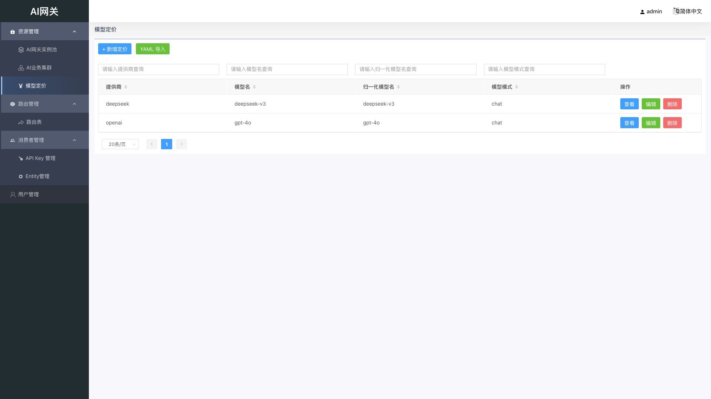
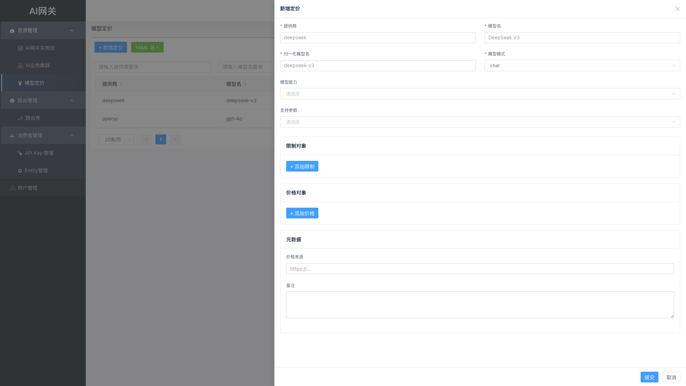
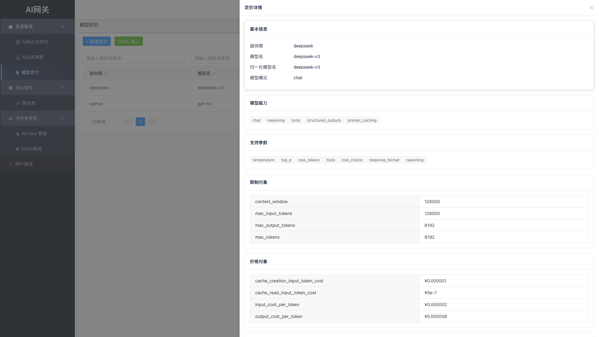
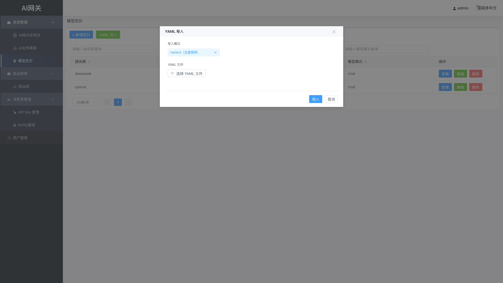

# 05 模型定价：管理模型价格与计费

模型定价用于维护各提供商 + 模型名的价格信息，供网关进行费用核算。定价数据以「提供商 / 模型名 / 归一化模型名 / 模型模式」为唯一维度。

入口：资源管理 → 模型定价（或顶部菜单「模型定价」，视部署菜单配置而定）。

## 5.1 列表页

展示当前已维护的模型定价记录。

**表格列说明**：

| 列名 | 说明 |
| --- | --- |
| 提供商 | 价格关联提供商 |
| 模型名 | 模型名称 |
| 归一化模型名 | 基础模型名称 |
| 模型模式 | 模型能力模式 |
| 操作 | 详情、编辑、删除 |

列表上方有「新增定价」和「YAML 导入」按钮。

## 5.2 创建 / 编辑定价

点击「新增定价」或在操作列点击「编辑」，右侧弹出抽屉表单。

### 基础信息

| 字段 | 必填 | 默认值 | 校验规则 | 说明 |
| --- | --- | --- | --- | --- |
| 提供商 | 是 | 空 | 长度 1-255 | 价格关联提供商，需与集群 LLM 配置的「价格关联提供商」匹配 |
| 模型名 | 是 | 空 | 长度 1-255 | 模型名称 |
| 归一化模型名 | 是 | 空 | 长度 1-255 | 基础模型名称 |
| 模型模式 | 是 | 空 | 枚举值 | 模型能力模式，如 `chat`、`completion`、`embedding` 等 |

**mode 枚举值**（常用）：

| 枚举值 | 说明 |
| --- | --- |
| chat | 聊天对话 |
| completion | 文本补全 |
| responses | Responses API |
| image_generation | 图像生成 |
| image_edit | 图像编辑 |
| embedding | 文本嵌入 |
| rerank | 重排序 |
| audio_speech | 语音合成 |
| audio_transcription | 语音转录 |
| video_generation | 视频生成 |
| ocr | OCR |
| search | 搜索 |
| realtime | 实时交互 |

### 能力与支持参数

- **模型能力**：模型支持的能力标签，多选。如 `chat`、`vision`、`reasoning`、`tools`、`function_calling` 等。
- **支持参数**：模型支持的请求参数，多选。如 `temperature`、`top_p`、`max_tokens`、`tools`、`response_format` 等。

### 限制对象（模型限制）

动态键值对，键名从枚举值中选择，值为非负整数。

| 键名 | 含义 |
| --- | --- |
| context_window | 上下文窗口 |
| max_input_tokens | 最大输入 Token 数 |
| max_output_tokens | 最大输出 Token 数 |
| max_tokens | 最大 Token 数 |

> 同一「限制对象」中键名不能重复。

### 价格对象（价格）

必填；动态键值对，键名从枚举值中选择，值为非负数（最多 8 位小数）。至少添加一条。

常用价格字段：

| 键名 | 含义 |
| --- | --- |
| input_cost_per_token | 每 Token 输入成本 |
| output_cost_per_token | 每 Token 输出成本 |
| cache_read_input_token_cost | 缓存读入 Token 成本 |
| cache_creation_input_token_cost | 缓存创建 Token 成本 |
| input_cost_per_token_above_200k_tokens | 超过 200k tokens 的输入成本 |
| output_cost_per_token_above_200k_tokens | 超过 200k tokens 的输出成本 |
| output_cost_per_image | 每张输出图像成本 |
| output_cost_per_second | 每秒输出成本 |
| input_cost_per_query | 每次查询输入成本 |
| ocr_cost_per_page | 每页 OCR 成本 |

> 表单中「价格货币」固定为 `RMB`，无需输入。

### 元数据

- **价格来源**：来源 URL，需符合 URL 格式。
- **备注**：备注文本。

## 5.3 查看详情

点击行或操作列「详情」，右侧弹出只读抽屉，展示全部字段：

- 基础信息：提供商、模型名、归一化模型名、模型模式
- 模型能力、支持参数（标签展示）
- 限制对象、价格对象（键值对表格）
- 元数据（价格来源、备注）
- 创建时间、更新时间

## 5.4 YAML 导入

点击列表上方「YAML 导入」，弹出导入弹窗：

- **导入模式**：
  - `replace`：替换已有数据。
  - `merge`：与已有数据合并。
- **上传文件**：支持 `.yaml` / `.yml` 文件。
- 系统上传前会解析并校验 YAML 中 `version` 存在、`default_currency === 'RMB'`。
- 导入完成后展示成功数、跳过数、错误列表。

## 5.5 注意事项

- 创建/编辑时前端会校验（提供商、模型名、模型模式）组合唯一性。
- 「限制对象」和「价格对象」中键名均不能重复。
- 价格字段为非负数，最多 8 位小数。
- 提供商需与集群 LLM 配置中的「价格关联提供商」匹配，费用核算才能生效。
