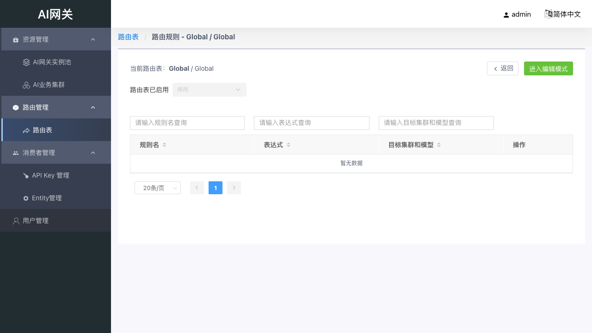
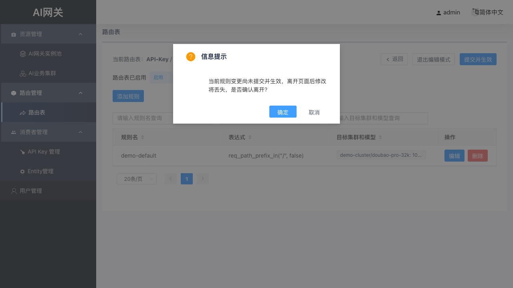

# 06 路由管理：路由表与路由规则

路由决定「请求按什么规则、以什么比例转发到哪些集群 + 模型」。系统预置三种作用域的路由表：

| 路由表类型 | 作用范围 |
| ------ | ------ |
| Global | 全局兜底，所有未命中更具体路由表的请求 |
| Entity | 命中指定组织的请求，该组织下所有 Key 共享 |
| API-Key | 命中指定 API-Key 的请求，专属规则互不干扰（最常见用法） |

匹配优先级：**API-Key > Entity > Global**。

**匹配语义**：同一路由表内，规则按列表顺序依次匹配表达式，**命中第一条即停止**，请求按该规则的目标权重转发；全部规则未命中时回落下一优先级路由表 / 走系统默认转发。因此更具体的规则应排在前面。

## 6.1 路由表列表

路由管理 → 路由表，列表展示表名、类型（global / entity / apikey）、属主、启用状态；行内可启用 / 停用、点击「查看」进入该表的路由规则页。

- **启用 / 停用**：停用后该路由表规则不再生效，流量回落到下一优先级路由表。
- Key 创建后会自动生成属主为该 Key 的 apikey 路由表（见 [05 章](05-entity.md)）。

## 6.2 路由规则列表与编辑模式

进入某张表后展示规则列表，页顶部显示当前路由表与「路由表已启用」状态开关。

规则的新增 / 编辑 / 删除需在**编辑模式**下进行：先「进入编辑模式」，改完「本地保存」，再点击「提交并生效」——提交后自动退出编辑模式，变更下发到数据面生效。编辑态的修改未提交前不影响线上流量，避免误操作。

规则列表发生变更但尚未「提交并生效」时，点「返回」、面包屑或切换其他菜单都会弹出信息提示「当前规则变更尚未提交并生效，离开页面后修改将丢失，是否确认离开？」；「确定」放弃修改离开，「取消」回到编辑页继续：

## 6.3 添加规则

编辑模式下点击「添加规则」打开抽屉：

| 字段 | 必填 | 说明 |
| ------ | ------ | ------ |
| 规则名 | 是 | 表内唯一，如 `demo-default` |
| 表达式 | 是 | 匹配条件；可用条件构造器点选生成，也可直接编辑表达式文本 |
| 目标集群和模型 | 是 | 至少一个目标；多个目标时按权重分配 |

**表达式构造器**

表达式为 BFE 条件表达式（保存时经 `/expression/verify` 校验合法性），构造器按维度提供操作符按钮点选生成：

- 逻辑连接符：`( )`、`&&`、`||`、`!`
- 条件维度与操作符：

| 维度 | 操作符（生成的表达式） | 示例 |
| ------ | ------ | ------ |
| host | in | `req_host_in("www.a.com\|www.b.com")` |
| port | in | `req_port_in("80\|8080")` |
| method | in | `req_method_in("GET")` |
| path | in / prefix_in / suffix_in | `req_path_prefix_in("/v1/", false)` |
| query | exist / key_in / key_prefix_in / value_in / value_prefix_in / value_suffix_in / value_hash_in | `req_query_value_in("search", "flower", false)` |
| cookie | key_in / value_in / value_prefix_in / value_suffix_in / value_hash_in | `req_cookie_value_in("ssp-web-version", "v0", true)` |
| header | key_in / value_in / value_prefix_in / value_suffix_in / value_hash_in | `req_header_value_in("api_version", "v1\|v2", true)` |
| clientIP | range / trusted / hash_in | `req_cip_range("1.1.1.1", "2.2.2.2")` |
| proto | secure | `req_proto_secure()` |
| system | bfe_time_range / bfe_cluster_in | `bfe_time_range("20190204203000H", "20190204204500H")` |
| body | req_body_json_in | `req_body_json_in("level1.level2.level3", "pat1\|pat2", false)` |

常用场景示例：

| 场景 | 表达式示例 |
| ------ | ------ |
| 兜底匹配所有请求 | `req_path_prefix_in("/", false)`（或`default_t()`） |
| 按路径前缀分流 | `req_path_prefix_in("/v1/", false)` |
| 按 Header + 方法分流 | `req_header_value_in("api_version", "v1\|v2", true) && req_method_in("POST")` |
| 按查询参数灰度 | `req_query_value_in("gray", "1", false)` |

**目标与权重**

| 字段 | 说明 |
| ------ | ------ |
| 集群 | 下拉选择已创建的业务集群 |
| 模型 | 留空表示透传请求中的模型名；指定则转发到该模型 |
| 权重 | 多目标时流量分配比例，**所有目标权重之和必须等于 100** |
| + 添加目标 | 增加目标行 |

保存并提交后，规则出现在列表且表为启用状态：

## 6.4 查看规则

非编辑模式下点击规则行可打开「查看规则」，只读展示表达式与目标配置。

## 6.5 校验规则

- 同一规则内**目标权重之和必须等于 100**，否则保存被拦截；
- 同一规则内「集群 + 模型」组合不能重复；
- 规则名不能重复；
- 表达式语法错误会在保存时提示，请参照构造器生成的格式编写。

## 6.6 注意事项

- 修改规则后需保存 / 提交才会下发生效。
- 停用路由表前请确认回落路径可用，避免流量中断。
- 路由表停用或表达式不匹配时，请求回落下一优先级路由表（见开头优先级说明）。
