# 10 场景实战：从零到第一次调用成功的完整示例

本章面向刚部署好网关的开源用户，给出一个**完整、可照做**的配置示例：把一个后端模型服务接入网关，签发 API Key，配置路由，最后用 curl 调用成功。主示例跑通后，再按需查看文末的进阶扩展。

## 10.0 示例目标与全景

**前提**：

- 已按部署文档完成三个组件的部署：控制台（Web 管理界面）、BFE 数据面（请求转发引擎）、conf-agent（配置同步助手），能正常登录控制台（部署说明见 [Web 部署](deploy.md)、[API 部署](https://github.com/infinity-ai-gateway/ai-gateway-api/blob/develop/docs/zh_cn/deploy.md)）；
- 手头有一个可用的模型服务：自建 OpenAI 兼容服务（vLLM / Xinference / Ollama 等），或公有模型服务商（DeepSeek / OpenAI / Qwen 等）。

**配置完成后的请求链路**：

```text
客户端  curl -H "Authorization: <API Key>"  POST /v1/chat/completions
   │
   ▼
BFE 数据面 ─ ① 模型访问控制(不通过 403) → ② 限流(触发 429) → ③ 配额扣减(不足拒绝)
   │
   │  路由表 apikey（该 Key 专属）：规则命中 → 目标 = demo-cluster + 模型
   ▼
业务集群 demo-cluster ── 自建服务 10.0.0.10:8000 ／ 服务商域名
```

**配置链路总览**（本章按顺序执行）：

| 步骤 | 动作 | 入口 |
| ------ | ------ | ------ |
| 1 | 实例池登记转发引擎地址 | 资源管理 → AI 网关实例池 |
| 2 | 创建业务集群（接入模型服务） | 资源管理 → AI 业务集群 |
| 3 | 创建 Entity 类型与组织（调用方分组，可选） | 消费者管理 → Entity 管理 |
| 4 | 签发 API Key（调用凭证） | 消费者管理 → API Key 管理 |
| 5 | 配置 API-Key 路由规则（集群 + 模型） | 路由管理 → 路由表 → 该 Key 的 apikey 表 |
| 6 | curl 调用验证 | 终端 |

**示例取值表**（替换成你自己的环境即可）：

| 配置项 | 示例值 |
| -------- | -------- |
| 后端地址 | 172.19.1.187，端口 13801 |
| 集群名称 | demo-cluster |
| 协议 | https |
| 模型服务商类型 | `huoshancodeplan`（**请替换为你环境下拉框中的实际选项**，如 `deepseek`、`openai`、`qwen` 等） |
| 模型名 | doubao-pro-32k |
| Entity 类型 / 组织 | team（级别 3）/ dev-team |
| 路由表达式 | `req_path_prefix_in("/", false)` |

## 10.1 步骤 1：实例池

实例池维护本网关**转发引擎（数据面）**的实例地址，请求由这些实例接收并转发。单机部署时确认列表中已有引擎地址即可；若为空，点「编辑」新增一行（机器名 / IP / 端口，字段说明见 [03 章](03-ai-gateway-pool.md)）。


> 注意：后端模型服务地址**不**登记在实例池，它在下一步集群的「实例配置」中直接填写。
>
> 如果你不确定填什么，先看你的 BFE 部署在哪台机器上，就填那台机器的 IP + 端口 8080（或部署时配置的端口）。

## 10.2 步骤 2：创建业务集群

资源管理 → AI 业务集群 → 「添加集群」，向导共 6 步：

**第 1 步 基础配置**

| 字段 | 示例值 |
| ------ | -------- |
| 集群名称 | demo-cluster |
| 协议 | https |
| 会话保持 | 停用（需要时见进阶 B） |

> **协议怎么选**：自建 vLLM / Ollama 等若无 TLS，选 `http`；对接公有云 HTTPS 接口或后端已启用证书时选 `https`。协议必须与后端实际监听方式一致，否则「获取模型」和 curl 都会失败。

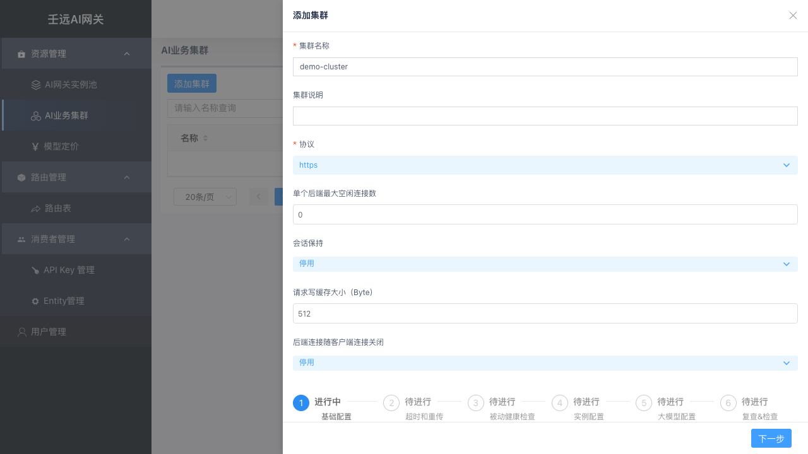

**第 2 步 超时和重传**：保持推荐默认值即可（如读后端响应头部超时 50000ms，见 [4.4 节](04-ai-business-cluster.md)）；服务商首包耗时长时可放宽该项。

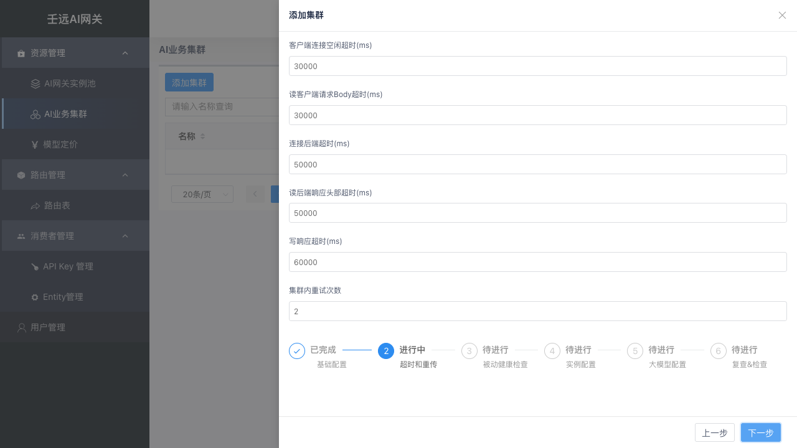

**第 3 步 被动健康检查**：保持默认；「健康检查期望的状态码」填 0 表示忽略状态码、有响应即健康。

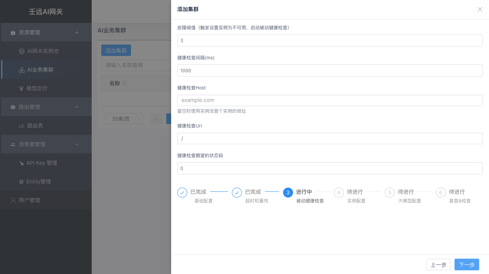

**第 4 步 实例配置**：

- 形态选 **IP**，填 IP `172.19.1.187`、端口 `13801`、权重 100；

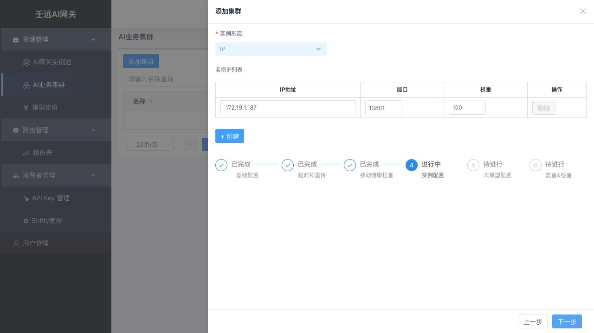

**第 5 步 大模型配置**

| 字段 | 示例值 |
| ------ | -------- |
| 模型服务商类型 | 从下拉框选择（如 `deepseek`、`openai`、`qwen` 等，**以你的环境实际选项为准**） |
| 模型列表接口 | 协议 https；地址 172.19.1.187:13801；路径 `/v1/models` |
| 模型 | 点「获取」后下拉选择：doubao-pro-32k（以实际获取到的模型列表为准） |

> 若模型服务商类型为 DeepSeek / OpenAI 等公有云，除选择类型外，通常还需填写「服务鉴权 Keys」，否则「获取」可能失败。

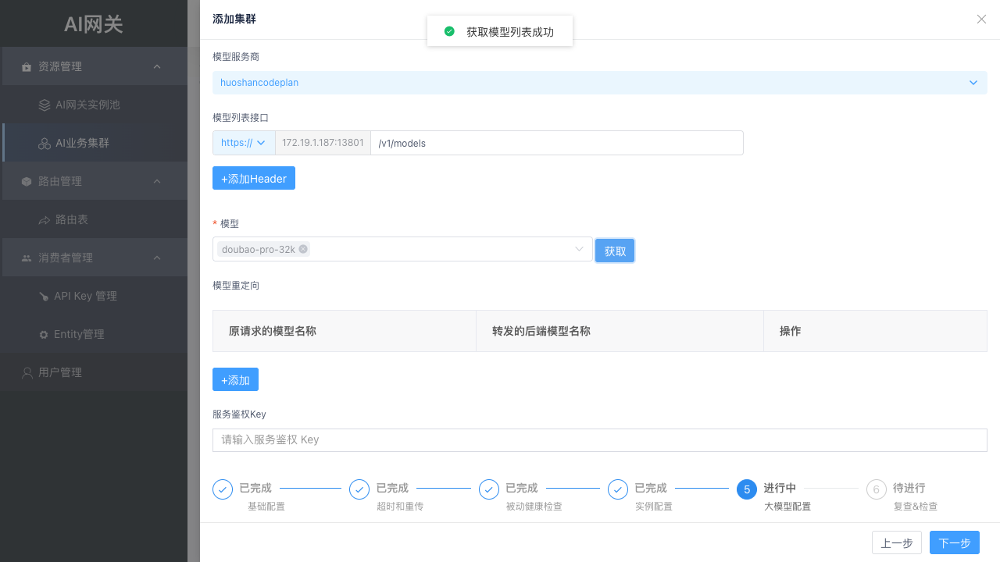

**第 6 步 复查&检查**：核对汇总信息后点「提交」，集群列表出现 demo-cluster 即创建成功。

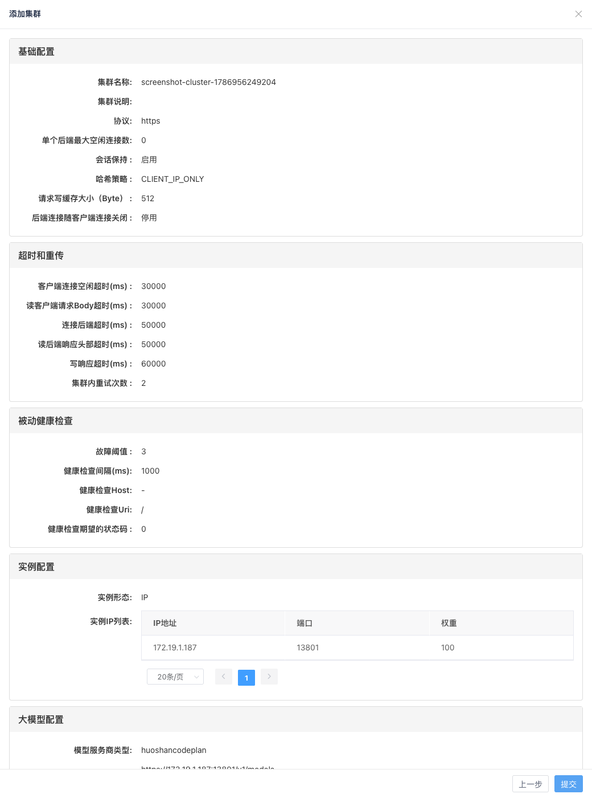

**常见坑**：点"获取"后弹出红色错误提示「参数非法 exec-api … connection refused」——**不要慌，这只表示"连不上你的后端服务"**。

> **排查步骤**：
>
> 1. 检查你填的 IP 和端口是否正确
> 2. 检查 BFE 机器能否访问该后端地址（网络是否通）
> 3. 确认后端模型服务已启动并监听对应端口
> 4. 错误通知不会自动消失，排查完后点右上角 × 关闭即可

## 10.3 步骤 3：创建 Entity 类型与组织（可选）

> 只想快速跑通可以跳过本步，步骤 4 创建不挂载组织的 API Key 即可。但建议完成：组织是配额 / 限流 / 模型访问控制的常用挂载点，是按团队治理成本与权限的基础。

1. 消费者管理 → Entity 管理 → 类型页签 → 「创建类型」：类型名 `team`、级别 `3`（3 = 团队级，见 [06 章](06-entity-type.md)）。
   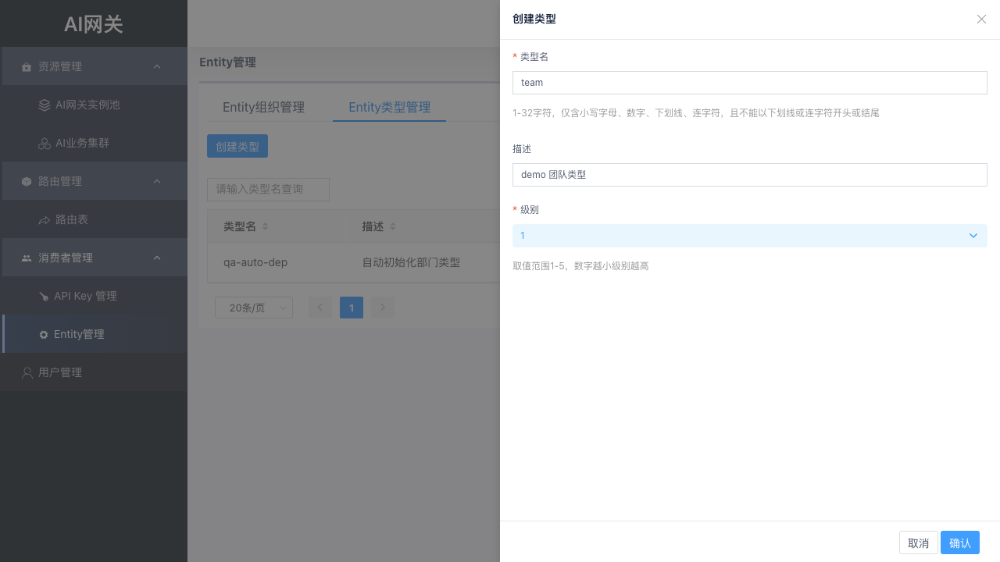
   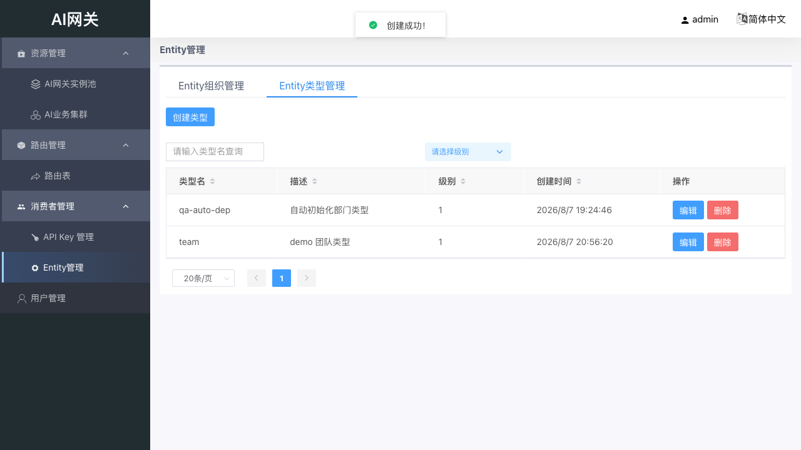
2. 组织页签 → 「创建Entity」：名称 `dev-team`、所属类型 `team`；允许模型保持 `*` 即可（配额 / 限流后续见进阶 A）。
   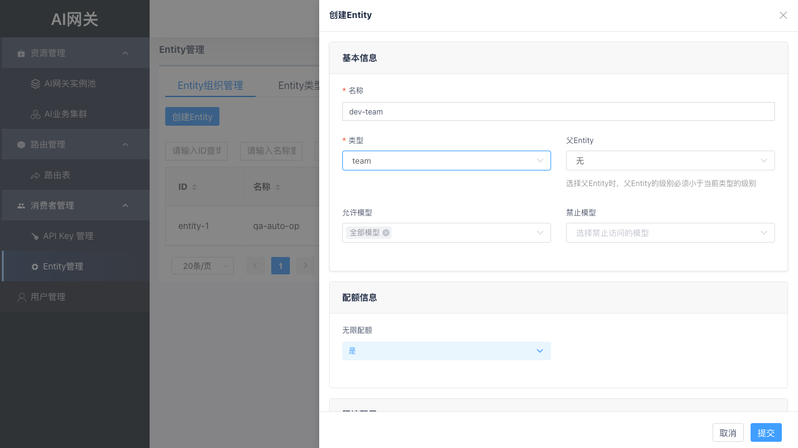
   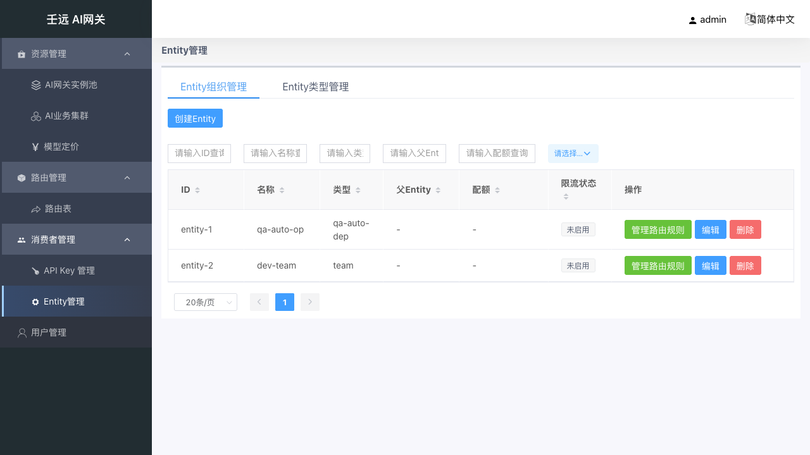

## 10.4 步骤 4：签发 API Key

消费者管理 → API Key 管理 → 「创建」：

| 字段 | 示例值 |
| ------ | -------- |
| 描述 | demo 第一个 Key |
| 过期时间 | 勾选永不过期（或按需指定） |
| 网段 | 默认 `*` 不限制 |
| 挂载Entity | 完成步骤 3 时填 `dev-team`；**跳过步骤 3 则留空** |

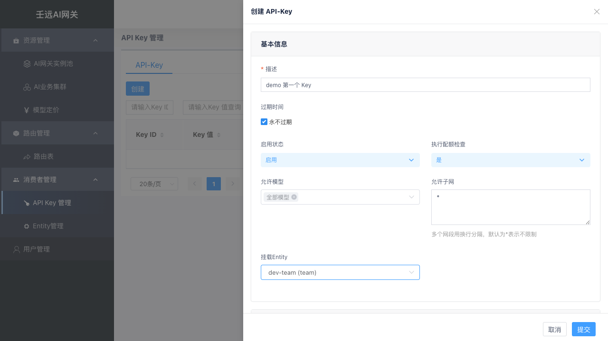

创建成功后点击列表的 Key 值复制保存，它就是调用凭证。

> **重要提示**：创建成功后，请同时记住列表中该 Key 的 **Key ID**（通常是 `api-key-1`、`api-key-2` 这样的编号）。下一步配置路由时需要用到它来找到自己的路由表。

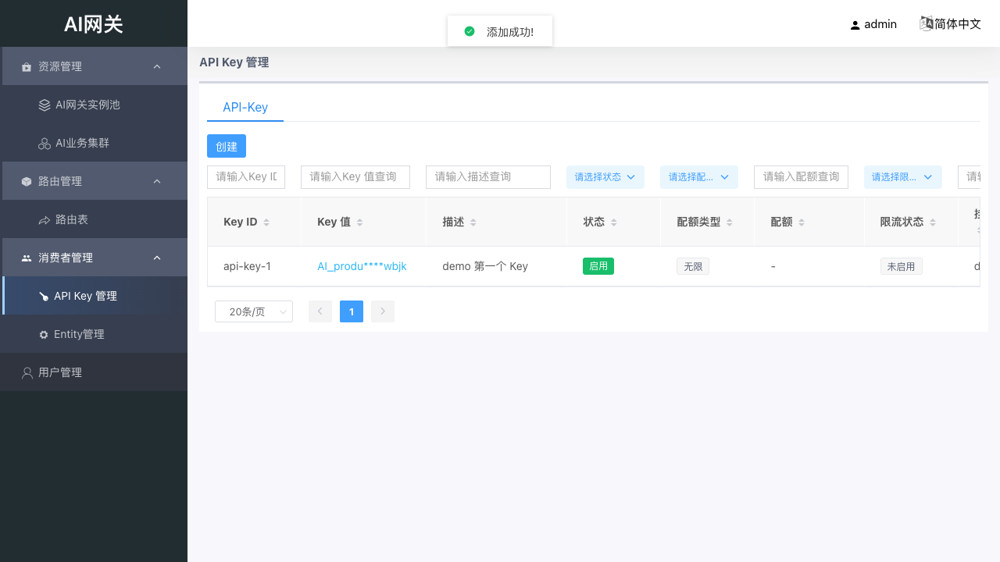

## 10.5 步骤 5：配置 API-Key 路由规则

> 路由表优先级：**API-Key > Entity > Global**（更具体的表优先匹配）。
>
> **本章在步骤 5 配置 API-Key 专属路由表**：步骤 4 创建 API Key 后，系统会自动生成属主为该 Key 的路由表（Key ID 如 `api-key-1`）。在此表中添加规则，该 Key 的请求就会按规则转发到指定集群——这是「按调用方隔离路由」的典型用法，也是本章主示例的做法。
>
> 补充说明：Global 表适合作为所有 Key 的兜底策略（见 [8.8 E 分层路由](#e-分层路由global-兜底)）；Entity 表适合按组织统一配置。本章只需完成 API-Key 表即可跑通。

1. 路由管理 → 路由表，找到"路由表属主"列显示为你刚才创建的 **Key ID**（如 `api-key-1`）的那一行，点击「查看」进入路由规则页。
   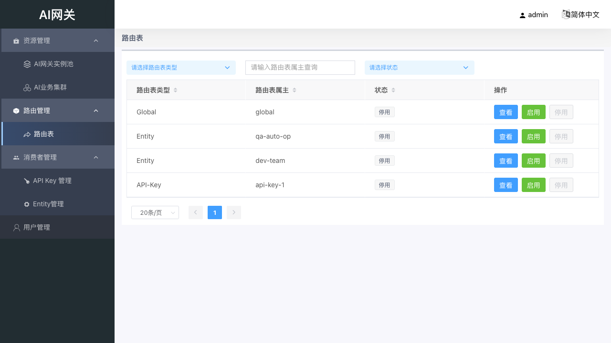
2. 「进入编辑模式」→「添加规则」：
   - 规则名：`demo-default`；
   - 表达式：在构造器中点 `path` 行的 `prefix_in` 生成条件，参数改为 `"/"`（兜底匹配所有请求）；
   - 目标集群和模型：集群选 `demo-cluster`，模型选 `doubao-pro-32k`，权重 100。

   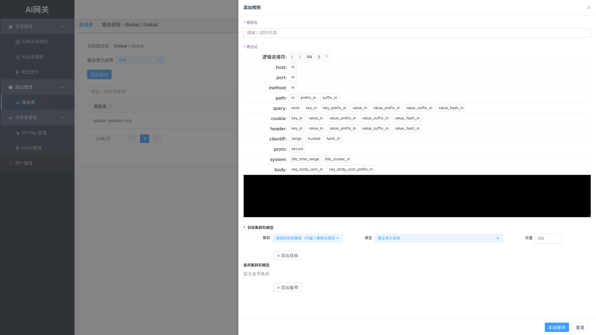
3. 「本地保存」→ 点击「提交并生效」（自动退出编辑模式）；确认规则出现在列表且路由表为启用状态。
   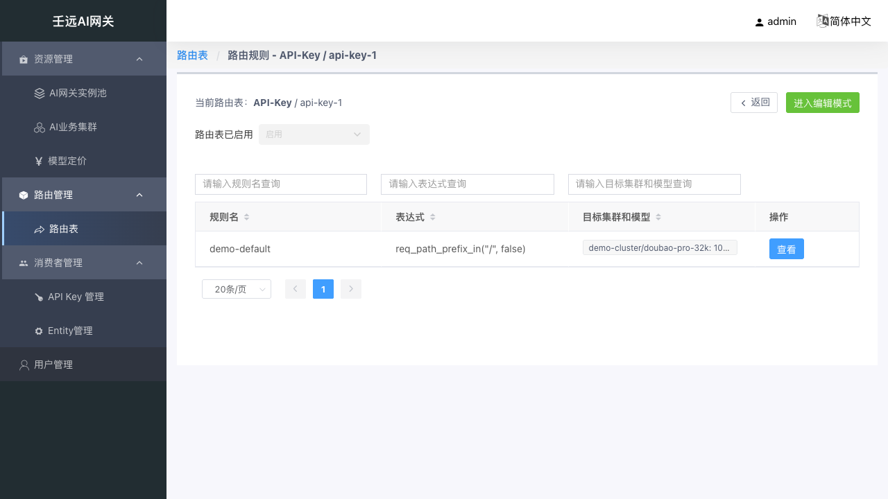

> 提交并生效后，配置通常在数秒到数十秒内同步到数据面（依赖 conf-agent）。若 curl 立即失败，可等待 10～30 秒后重试。
>
> **模型字段说明**：指定模型 = 统一转发到该模型；留空 = 使用 curl 请求体中的 model 字段（需与后端实际模型名一致）。

## 10.6 步骤 6：调用验证

向 **BFE 数据面地址**发送 OpenAI 兼容请求。

**数据面地址 = 02 章实例池中填写的 IP:端口**。例如实例池填的是 `192.168.1.100:8080`，那就向 `http://192.168.1.100:8080` 发请求。

> 注意：要从**能访问到 BFE 机器**的终端执行 curl。如果你在本机浏览器访问控制台，但 BFE 在远程服务器，curl 也要指向远程服务器的 IP。
>
> **Authorization 请求头**：直接填 Key 完整值，**不需要**加 `Bearer` 前缀。格式为 `Authorization: <你的 Key 值>`。

```bash
curl http://<数据面地址:端口>/v1/chat/completions \
  -H "Authorization: <步骤4保存的API Key完整值>" \
  -H "Content-Type: application/json" \
  -d '{
    "model": "doubao-pro-32k",
    "messages": [{"role": "user", "content": "你好，介绍一下你自己"}]
  }'
```

返回包含 `choices` 的正常 JSON 即配置完成。此后把 Key 与数据面地址交给应用或团队成员，任何 OpenAI SDK 兼容工具只需将 base_url 指向网关即可接入治理。

## 10.7 调用失败排查表

| 现象 | 常见原因 | 处理 |
| ------ | ---------- | ------ |
| 401 / 鉴权失败 | Key 填错、过期，或客户端 IP 不在允许网段 | API Key 管理 → 详情核对 |
| 403 | 请求模型不在 Key / 组织允许列表中，或在禁止列表中 | 核对允许模型，机制见 [7.5 节](07-entity.md) |
| 429 | 触发 TPM / RPM / 并发限流 | 检查限流配置，见进阶 A |
| 配额错误 | 组织或 Key 配额余额不足 | 详情页查看余量，必要时重置配额 |
| 未命中规则 | 表达式不匹配、API-Key 路由表停用或未配置 | 检查该 Key 对应路由表的规则表达式与启用状态；未配置时可检查 Global 兜底规则 |

更多错误提示对照见 [11 附录](11-appendix.md)。

## 10.8 进阶扩展（按需）

主示例跑通后，再按需求叠加以下能力：

### A. 成本治理：配额 + 限流

编辑组织（或 Key）：配额信息选「有限」+ 总量 + 重置周期，控制总成本；「启用限流」选是后添加 TPM 规则（滑动窗口控制 Token 吞吐）/ RPM 规则（固定窗口控制请求速率）。超限返回 429，配额不足返回配额错误且已扣减部分自动回滚。

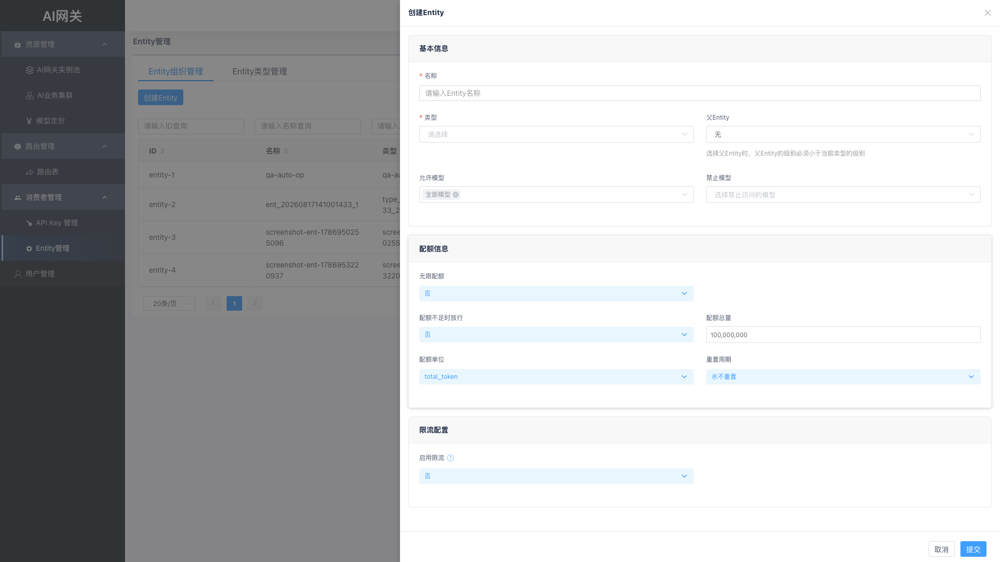

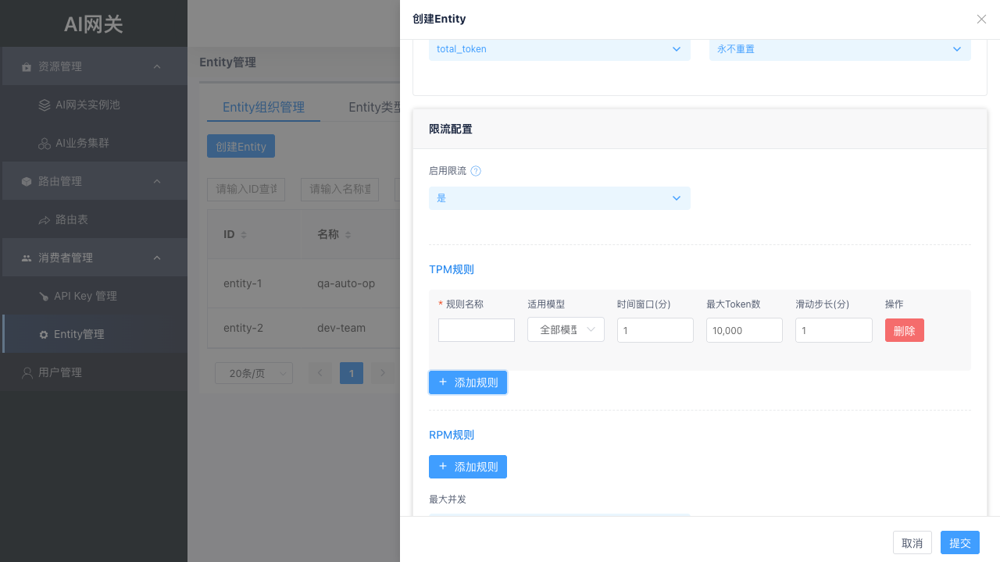

### B. 会话保持（哈希策略）

集群基础配置中会话保持 = 启用，再选哈希策略：请求能稳定携带用户标识 Header 时选 `CLIENT_ID_PREFERED` 并填哈希头部（如 `x-client-id`；Cookie 用 `Cookie:USERID` 格式）；只能依赖来源 IP 时选 `CLIENT_IP_ONLY`。

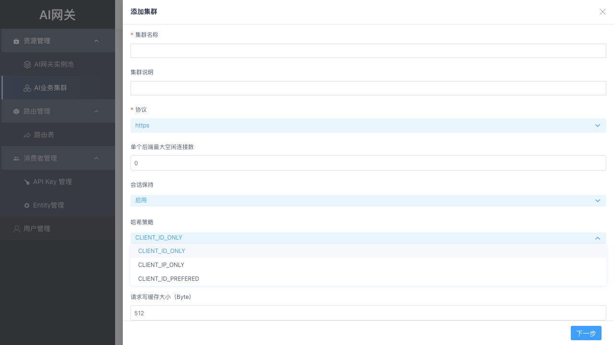

### C. 多模型流量分配

路由规则中添加两个目标：集群A+模型X 权重 80、集群B+模型Y 权重 20（权重和必须等于 100），按权重比例分发请求。

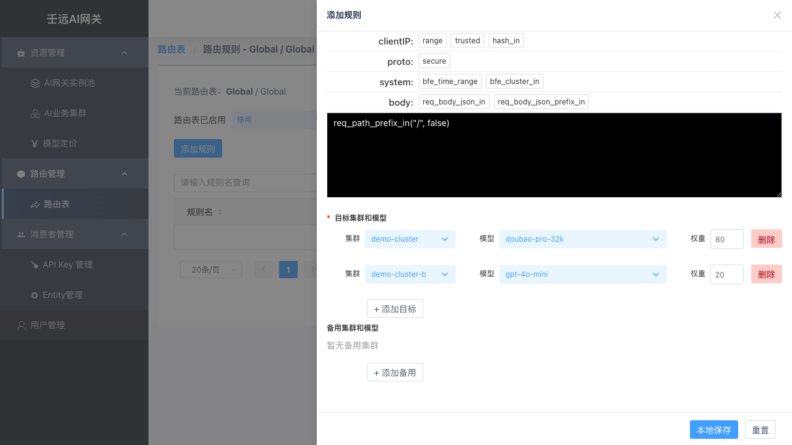

### D. 多级组织模型治理

按级别 company(1) → dep(2) → team(3) 创建类型并逐级建立组织、设置父级。运行时禁止模型优先、允许模型取交集：任意一层禁止列表命中、或允许列表不含请求模型即 403，适合集团 / 部门 / 团队三级合规管控。

### E. 分层路由（Global 兜底）

主示例已为每个 API Key 配置专属规则。如需统一兜底，可在 Global 表添加默认规则指向通用集群；API-Key 表停用或未命中时自动回落 Global。
